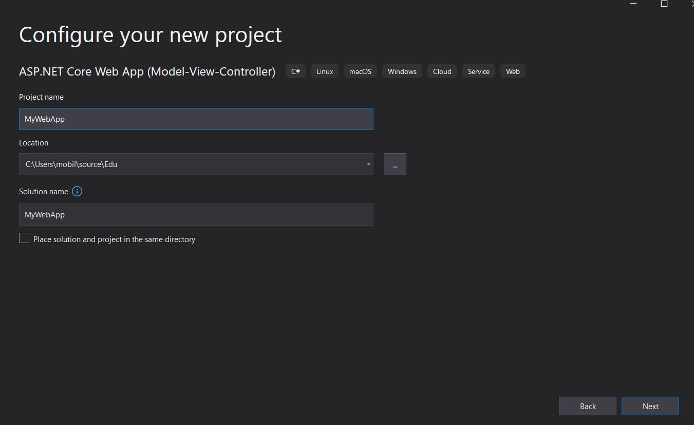

## Safely store app secrets in ASP.NET Core
Applications often need to store secrets, such as client_id and client_secret for OAuth connections or database connection strings. In the old days, it was not uncommon to store these secrets in the code and compile them as hard coded values. Today, this practice is less desirable and external configuration settings that can be changed without requiring a recompile of an application is much preferred. However, this new capability comes with a new set of responsibilities. 

In this article, we will learn about a few different ways to secure our secrets and make them configurable by environment for our applications. It is a best practice to avoid checking in our secrets to source control where they may be inadvertantly (or intentionally) leaked.

### Create a sample web application
We will use Visual Studio to create a sample web application to demonstrate how to store application secrets. 

1) Open Visual Studio

2) Click "Create a new project"

3) Select C# ASP.NET Core Web App (Model-View-Controller) project type
4) Select a location to create the project and give it a name. I named mine "MyWebApp".

5) Leave the defaults in the additional info dialog as shown below with.>NET5.0 (current), Authentication type:none, checkbox selected for Configure for HTTPS and everything else unchecked.


### Explore Startup.cs
Once the solution loads, find the `Startup.cs` file and open it. Inside you will find a number of items already configured. An important one for our use case is the `IConfiguration Configuration` property.

```c#
    public class Startup
    {
        public Startup(IConfiguration configuration)
        {
            Configuration = configuration;
        }

        public IConfiguration Configuration { get; }

        // This method gets called by the runtime. Use this method to add services to the container.
        public void ConfigureServices(IServiceCollection services)
        {
            services.AddControllersWithViews();
        }
    ...
```

In the Startup class constructor, the `IConfiguration configuration` parameter is provided to us by the dependency injection system using constructor injection and assigned to the `Configuration` property for later use.

For our sample app, let's create a variable to store a passkey that we could use to, for example, encrypt a string. 

```c#
        // This method gets called by the runtime. Use this method to add services to the container.
        public void ConfigureServices(IServiceCollection services)
        {
            services.AddControllersWithViews();
            string Passkey = "Pard0nMyDu5t";
            Console.WriteLine($"passkey: {Passkey}");
        }
```

I have added two lines of code inside the Configure Services method just below the `AddControllersWithViews()` line.

In this example, I have hard coded the actual key into the variable `Passkey`. If you run the application, 


you will see this passkey value displayed on the console.


There are several problems with this example. First, hard coding the value makes it difficult to change or rotate the key without re-compiling the application and re-deploying. Second, this value **will** get checked into source control where anyone with access to the source can see it. Not much of a secret.

In the next section, we will solve the first problem of moving the value from hard coded into an external configuration file.

### App settings in external config file
In ASP.NET Core projects, a developer can choose to store configuration values in an external file such as the appsettings.json file.


In our project, using the solution explorer view, locate the existing appsettings.json file and open it.

```json
{
  "Logging": {
    "LogLevel": {
      "Default": "Information",
      "Microsoft": "Warning",
      "Microsoft.Hosting.Lifetime": "Information"
    }
  },
  "AllowedHosts": "*"
}
```

You will see a json structure in this file. It currently contains 2 configuration properties `Logging` and `AllowedHosts`.


