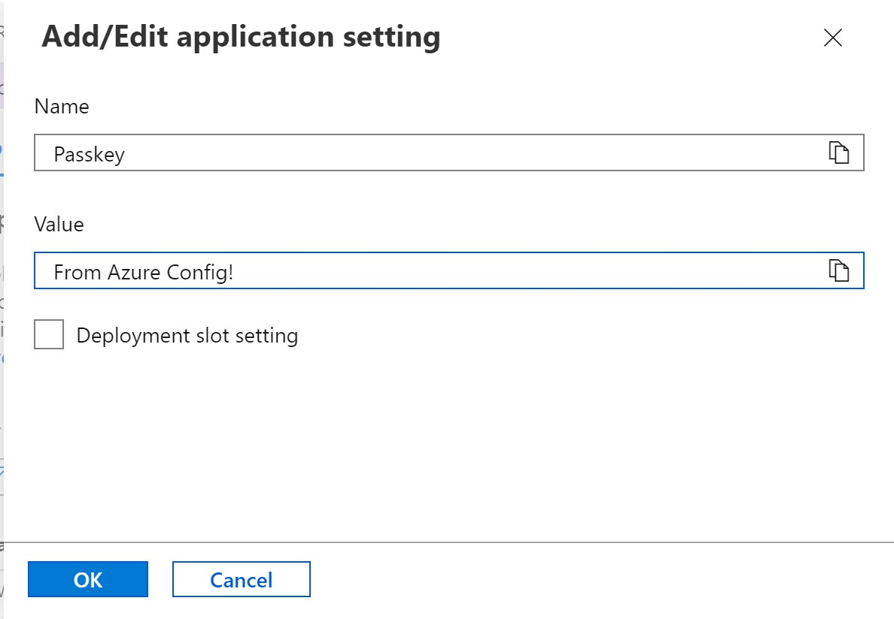
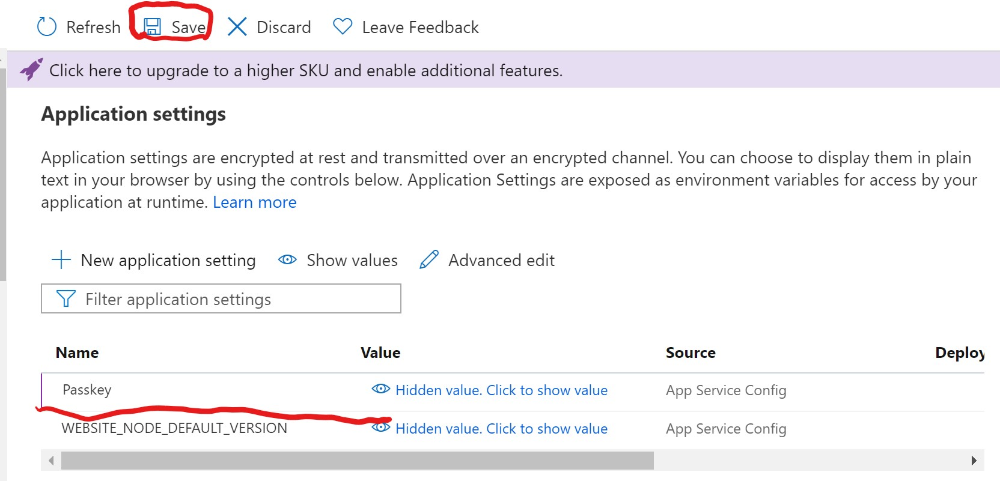
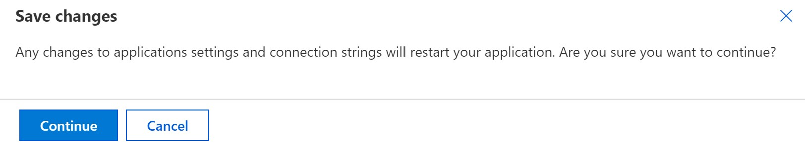
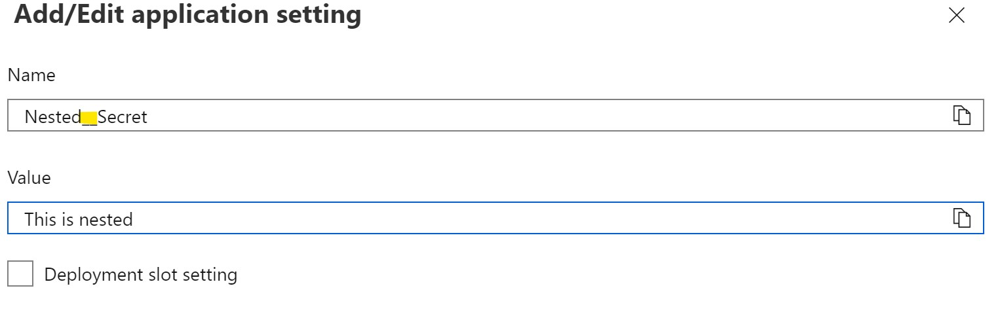
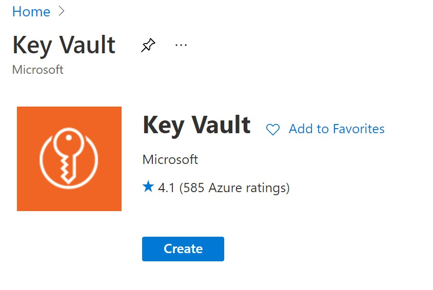
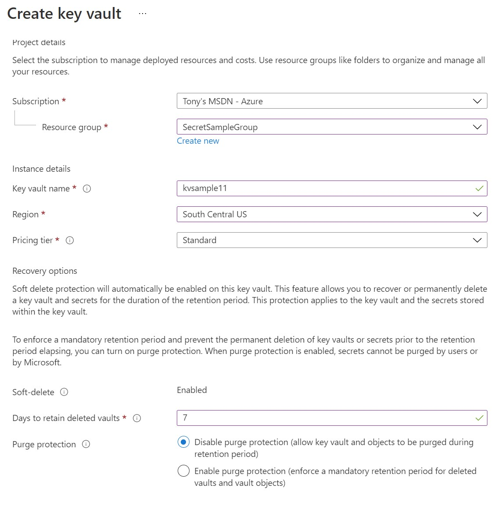
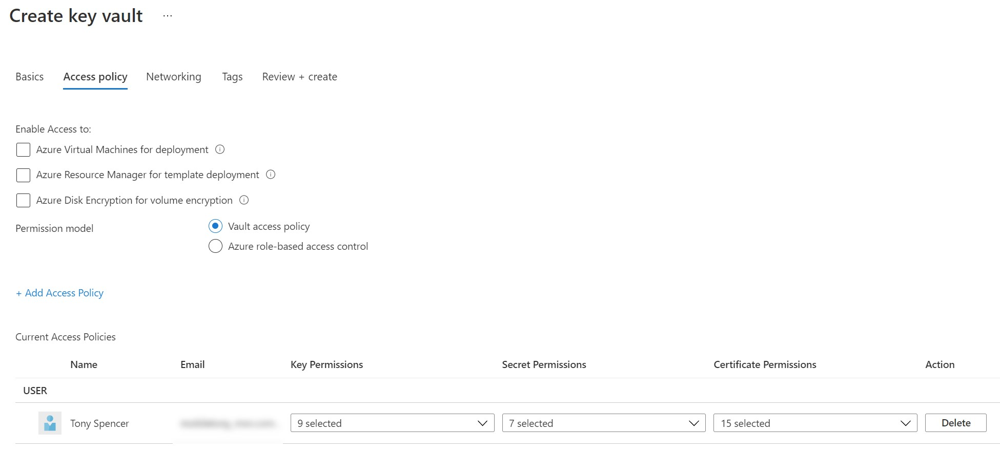
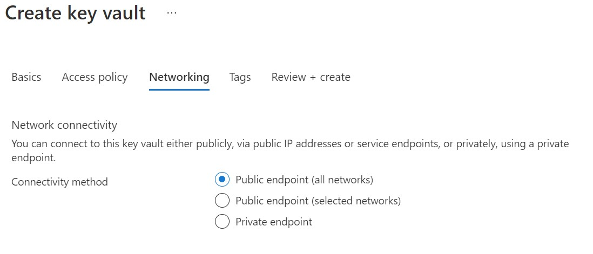
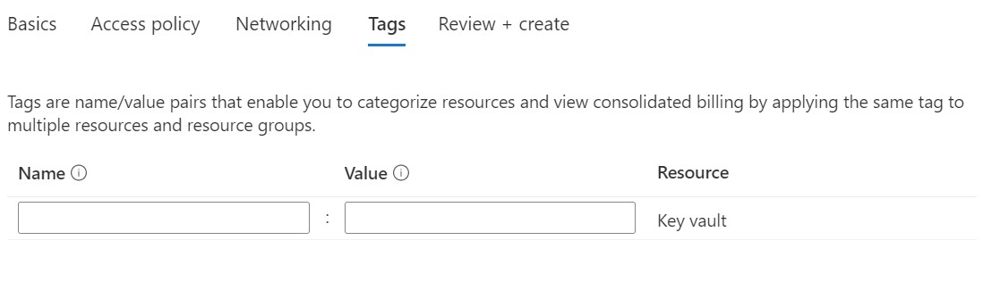
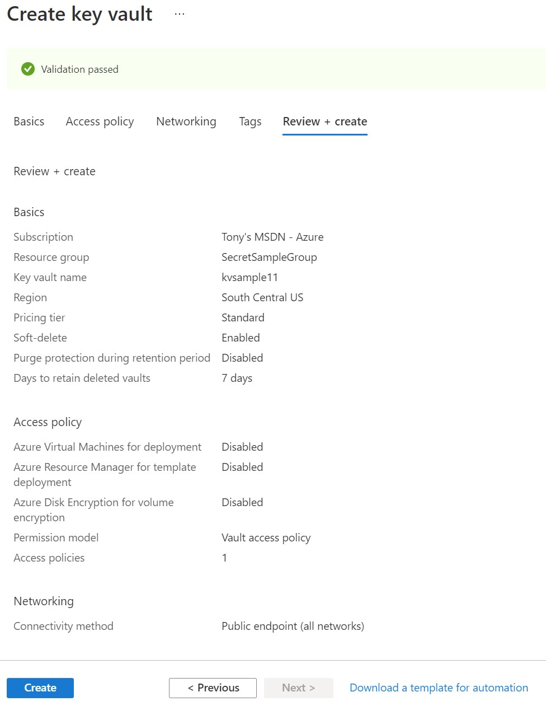

## Storing Config Values in Azure
In this article, we will demonstrate 2 primary ways of storing secrets data or configuration information for application deployed to Microsoft Azure:
1) Azure App Service Configuration
2) Azure Key Vault

In a previous post, we learned about keeping user secrets out of our code and out of config files that should not be checked into a code repository, particularly during development. In that post, we demonstrated how to use environment variables to set values on a server so that our code could get the config values it needed when it was deployed.

In this post, we will learn about alternative ways to store those values in Azure (if you deploy there) to support App Services, Functions, etc. using App Service Configuration and Azure Key Vault.

### Azure App Service Configuration
First, we are assuming that you have already created an Azure App Service instance and likely have deployed an application and are now awaiting a way to set environment variables or other secrets in the deployed configuration. If not, you can check out the blog post on "easy deploy to Azure App Service".

Navigate to the Azure Portal at https://portal.azure.com and login to your subscription.


Locate the app service on the portal. Mine is labeled "mysecretwebapp". Click the name to open the app service portal page.


Here you will see the left side navigation bar with several options. Under the settings section, locate and click "Configuration".


The configuration panel is divided into 4 tabs:
* Application settings
* General settings
* Default documents
* Path mappings

We are interested in the first tab for this exercise, "Application settings".

#### Add New Key/Value Pair

On this tab, there are two sections "Application settings" and "Connection strings". We will add a custom key/value pair to the first section. To do this, click the "+ New application setting" link.



The Add/Edit panel will appear. I added a key of "Passkey" with a value of "From Azure Config!" as depicted above. Then click the 'OK' button. Because we are using a free tier, we don't have access to deployment slots, so you can ignore the "Deployment slot setting" checkbox. If you had a deployment slot, such as a "staging" instance, you could assign the key to a specific slot.



Once you have added your new key/value pair, it will appear in the configuration panel, HOWEVER, you must click the save button at the top of the panel to apply the key or it will not be saved.

Once you do this, you will receive a warning:



The save changes dialog warns that these changes will cause your application to restart. Once your application restarts, it will have access to the new configuration value.

#### Nested key values
In our appsettings.json and secrets.json files, we can have nested settings for organizational purposes. This is usually represented like this:

```json
{
    "MyConfigValues":{
        "Passkey":"secret value"
    }
}
```
In code, we access this value using the `Configuration` object like this:

```c#
string Passkey = Configuration["MyConfigValues:Passkey"];
```

The nesting is accessible using the ':' colon character as a delimiter.

In contrast to the `json` configuration nesting, the Azure portal is a bit different. To store the value as a nested value, use two `__` underscore charaters to seperate the parent and child.



To retrieve the value in code, no changes will need to be made as the code in C# still uses a ':' colon character to delimit the parent and the child.

```c#
string Passkey = Configuration["Nested:Secret"];
```

### Azure Key Vault











