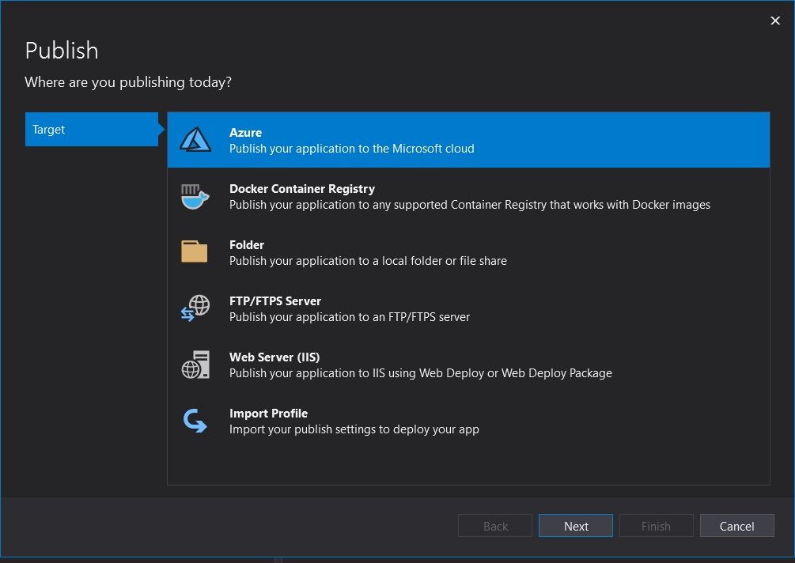
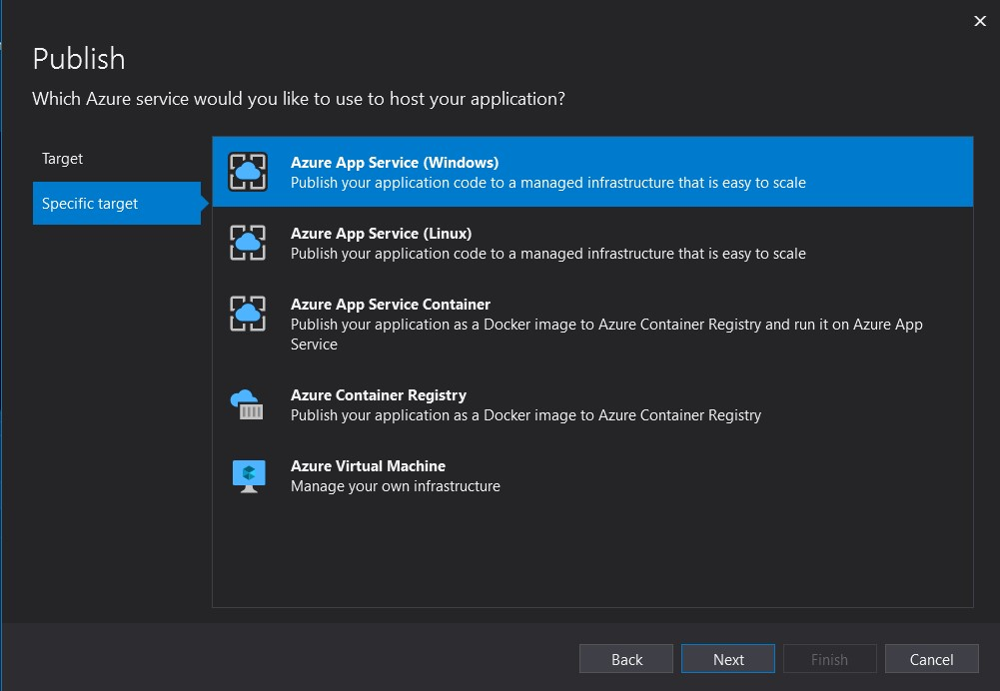
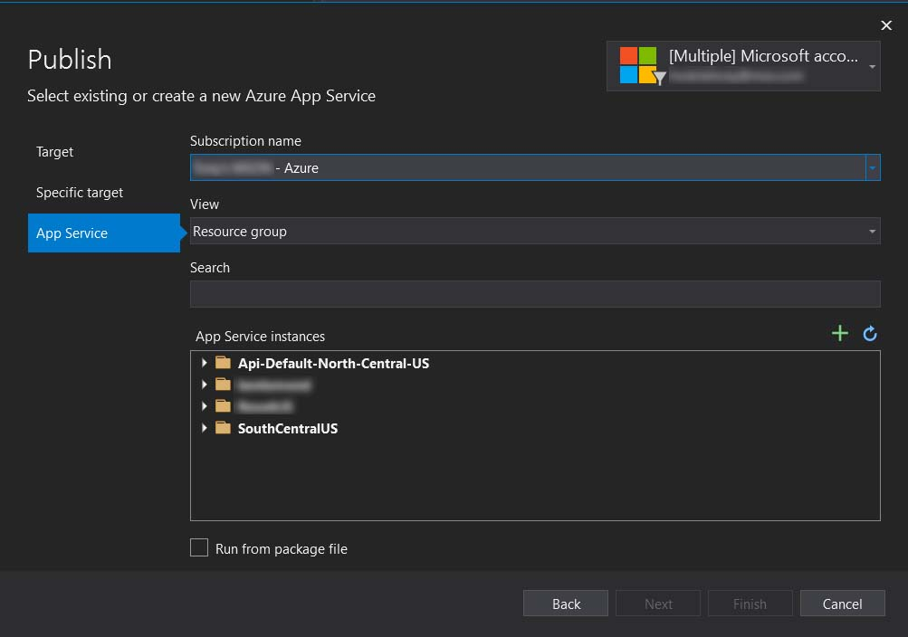
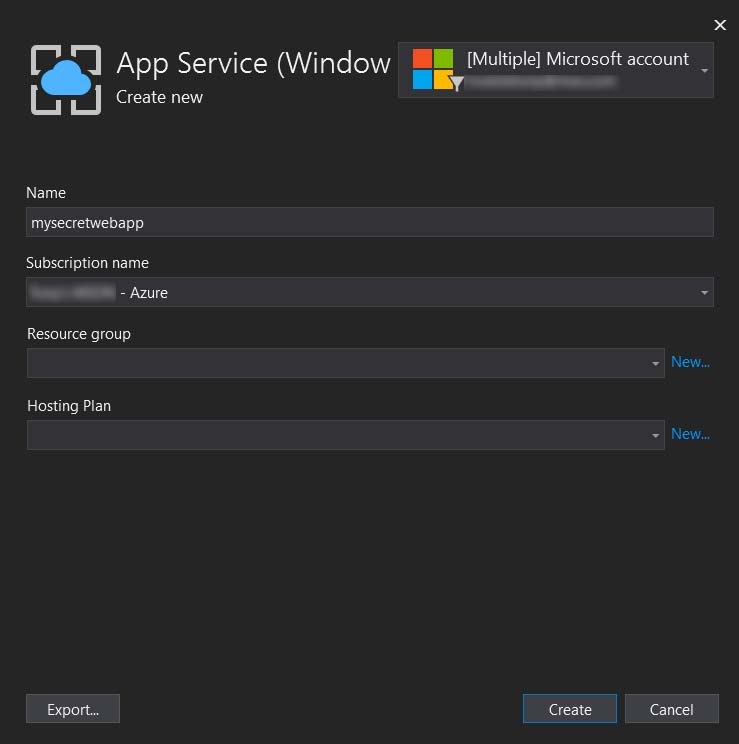
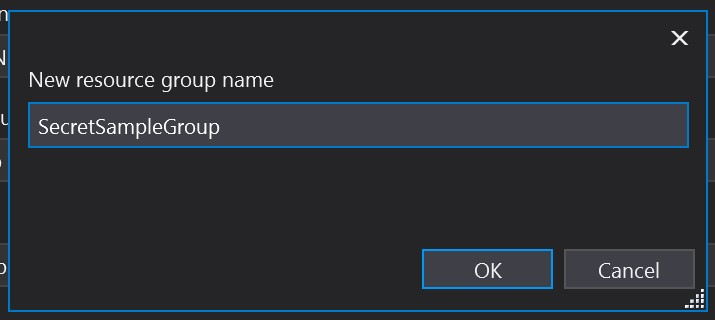
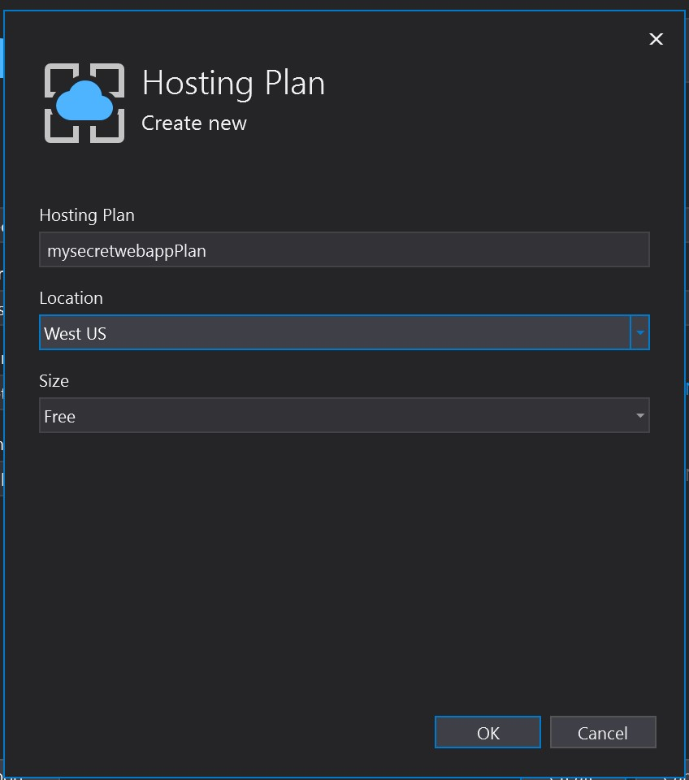
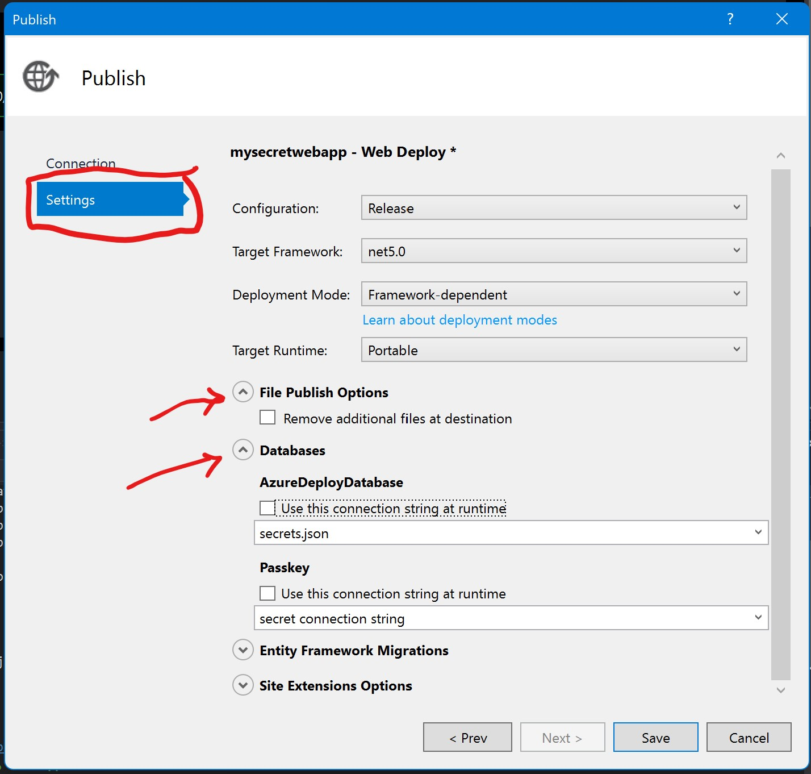

## Deploy to Azure App Service - Easy
So you have created your ASP.NET Core app and you want to deploy it somewhere. You decide you want to deploy it to Azure App Service because you have heard good things about it. 

If you are going to be deploying a production grade application, you should really use CI/CD (Continuous Integration/Continuous Delivery), however, if you are just experimenting and needing to deploy very quickly, you can do so directly from Visual Studio if you have a subscription to Azure.

### Signup for Azure Account
Make sure you have signed up for Azure account. Head over to https://azure.microsoft.com and signup for a free account trial.

### Load Your App in Visual Studio
Open Visual Studio and load your project that contains your previously created web application.

In my case, I have a sample application called "MyWebApp". Right click the project in the solution explorer window and select the "Publish" menu item.

### Publishing your app to Azure
In the publish (target) dialog window, select "Azure" and then click "Next".

In the next frame  (specific target) of the dialog window, you have options for:
1) Azure App Service (Windows)
2) Azure App Service (Linux)
3) Azure App Service Container
4) Azure Container Registry
5) Azure Virtual Machine

For the purpose of this post, we will choose to deploy to either option 1 or 2, Azure App Service for Windows or Linux. I am going to select option 1 and click the "Next" button.

When the next frame loads (app service) we can select the subscription, view type (resource group or services) are given a search box and can pick from a list of instances to deploy to.

Before we move on, lets talk about resource groups. Resource groups are a "collection" of different azure services, grouped together. For instance, your app may require a web host (app service), and a database, some blob storage (or a place to store persisted files such as images that aren't deployed with your web app) and an azure function. Resource groups let you keep all of these related serves "bundled" together so you can track them more easily.

First, lets create a new app service instance since this is the first time we are deploying. Once created, we won't be prompted for this during future deployments.

Click the green '+' symbol just above the list of "App Service Instances" to create a new app service.

A new dialog for the "App Service - Create New" should appear.

We will give it a "Name" for our application. The name you choose will become part of the public url you will be assigned and will need to be unique (no other person has used that name). For instance, if no one else has registered **"mysecretwebapp"** as a name for their application, I can set that as the name. After we deploy, the app will be reachable at "https://mysecretwebapp.azurewebsites.net".

I will assume that we need to create a new resource group for the purpose of this deployment as this is the first time we are deploying it. Click "New..." next to the Resource group field.

In the new resource group dialog, give it a name. This needs only be unique within your subscription and is not global like the app service name, so you won't be competing with others for a cool name here. I named mine "SecretSampleGroup".

Next, click the "New..." next to the Hosting Plan field. This will let us choose a plan for hosting and a data center location. It ranges anywhere from free to rather large computing resources (and can get expensive. Definitely for those who need such power). 

First, name your plan. I named mine "mysecretwebappPlan".

Next select a location. I chose West US, but you can choose any data center location you would like.

Finally choose the size. I chose "Free" because I don't need performance and scalability for this sample, test application.

Once this dialog is completed as in the screenshot below, click the next button to continue on.

You will see a new "Public" page in your Visual Studio project. This is the page you will see when you publish from now on. 

This is saved in your solution as an XML file:

Back to the new publish page, when we are ready to deploy, simply click the "Publish" button on this page and your app will begin to deploy.

On the first attempt, it will check to make sure that the deployment will be successful and is looking for things like .net 5.0 version support among other things.

After the checks complete, it will begin deployment (assuming the checks were successful). On success you should see a screen like this:

The publish step will even launch your default browser and load the page so you can test it.

### Editing publish settings

