## StarDrive - Building the Client Agent
Let's begin by building the client agent for the remote machine. As of this writing, the current version of .Net Core is .NET 7 and Visual Studio 2022 is the latest IDE version.

### Create the Project

1. Open Visual Studio (2022).

2. Select **"Create a new project"**


3. The templates dialog will open. There are a lot of templates to choose from and it can be overwhelming. You can use the filters and the searchbox to reduce the options. In the searchbox, type `"console"`. Additionally, select `"C#"` as the language from the language drop down box just below the searchbox.


4. Choose the `Console App` for .Net (not the older .Net Framework version)

5. Choose a name for the application. In this case, I chose `StarDrive.Agent`. Make sure the solution name is simply `StarDrive` to distinguish it from the StarDrive.csproj project file. Click **Next** to continue.


6. Choose a version of .NET to target. We will want to target the latest as of this writing, version 7. We will leave the checkbox unchecked for "Do not use top level statements". Then click CREATE.


7. This will generate our project from the base template and place the project inside of a solution. In this screenshot, notice that the project opened the Program.cs file, which is the starting point for our application.


We now have a project created!

### First Run
Let's run the project and make sure everything happens as expected.  To (build) and run the project, simply press the Play button on the toolbar:


This will build the app, and run it once it has compiled.


Not too exciting here, but notice that it output the text "Hello, World!" That's good, it means it worked.


### Directory Browsing Code:
One of the key responsiblities for our StarDrive app will be to browse the directories of the remote machine. Specifically, it will be the responsiblity of the `Agent` console application.

There are a couple of ways to browse directories with C# and .Net Core. Using the `System.IO` namespace, we can employ some static methods to do our work. See  Perhaps you have seen code like this before?

```C#
string path = @"C:\StarDriveData\";

string[] folders = System.IO.Directory.GetDirectories(path);
string[] files = System.IO.Directory.GetFiles(path);

foreach (var folder in folders)
{
    Console.WriteLine(folder);
}

foreach (var file in files)
{
    Console.WriteLine(file);
}
```
The `GetDirectories()` and `GetFiles()` methods return an array of strings ( string[] ) with the full path of the directories or files located immediately at the designated path.

If you were to run the code above, you might see output that look like this:

```cmd
C:\StarDriveData\Documents
C:\StarDriveData\Music
C:\StarDriveData\Pictures
C:\StarDriveData\Videos
C:\StarDriveData\SampleText.txt
```

In the above code block, the first four entries are folders or directories. The last entry is a file `SampleText.txt`.

The trouble with relying on these two methods is that they don't offer more details such as FileSize, LastModifiedDate, etc. To get the information we will need, we can use another class called `DirectoryInfo`. This class provices similar data, except it also includes FileSize, LastModifiedMethod and more. Let's rewrite the above code to use DirectoryInfo:

```C#
string path = @"C:\StarDriveFiles\";

DirectoryInfo di = new DirectoryInfo(path);
if (di.Exists)
{
    FileInfo[] files = di.GetFiles();
    foreach(var f in files)
    {
        Console.WriteLine(f.Name);
    }

    DirectoryInfo[] folders = di.GetDirectories();
    foreach(var f in folders)
    {
        Console.WriteLine(f.Name);
    }
}
```

The return types of `FileInfo[]` and `DirectoryInfo[]` give us more than just a string of the path, but rather several useful file/directory attributes. It is a good idea to wrap the functions `GetFiles` and `GetDirectories` in a check to ensure that the path exists first as noted by this line from the code block above:

```C#
if (di.Exists) { 
    ...
}
```
We will do more with this code later on, but for now if we run this it should work and provide us access to attributes for directories and files in our target path.

>To learn more read [how to get information about files, folder and drives in C#](https://learn.microsoft.com/en-us/dotnet/csharp/programming-guide/file-system/how-to-get-information-about-files-folders-and-drives) on the Microsoft Learn website.

### Create a Simple DTO (Data Transfer Object)
The goal of our remote app is to send data back to the web server so we can browse the file system. We could try to send the `FileInfo` class over the network to the web server, but it is not an insignificant class.

If we examine the `FileInfo` class in our locals window while debugging, we can see we have a pretty big object on our hands.

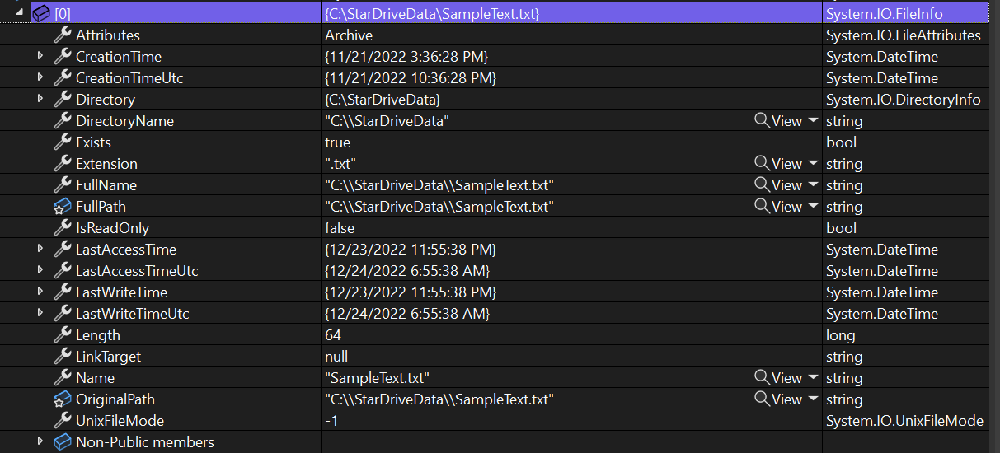

So rather than send such a heavy object to the server, let's create a simpler version. 

Add a class called `DirectoryItem.cs` to the solution explorer (in the root should be sufficient for now). The class will be a simple `POCO` class, or Plain Old C# Object.

```C#
internal class DirectoryItem
{
    public bool IsDirectory { get; set; }
    public string? Name { get; set; }
    public string? Path { get; set; }
    public DateTime LastModified { get; set; }
    public long Size { get; set; }
}
```

This will provide us with a nice simple structure that can be serialized to Json or another serializer to send across the wire more efficiently. This is known as a DTO, or Data Transfer Object. It is optimized for serializing and transport.

Next, let's modify the directory browsing code to not just write to the console, but populate a list of `DirectoryItems` for transport:

```C#
List<DirectoryItem> directoryItems= new();

DirectoryInfo di = new DirectoryInfo(path);
if (di.Exists)
{
    FileInfo[] files = di.GetFiles();
    foreach(var f in files)
    {
        var directoryItem = new DirectoryItem() { Name = f.Name, IsDirectory = false, Path = f.FullName, LastModified = f.LastWriteTime, Size=f.Length };
        directoryItems.Add(directoryItem);
    }

    DirectoryInfo[] folders = di.GetDirectories();
    foreach(var f in folders)
    {
        var directoryItem = new DirectoryItem() { Name = f.Name, IsDirectory=true, Path=f.FullName, LastModified=f.LastWriteTime };
        directoryItems.Add(directoryItem);
    }
}
```
Notice the primary difference between `FileInfo[]` and `DirectoryInfo[]` is that files have a `length` or size to them (in bytes) and we mark the `IsDirectory` property in our DTO accordingly.

If you want to see the effect, you can add this code below to the end of the above code and run it:

```C#
foreach (var d in directoryItems)
{
    Console.WriteLine($"{d.Name} - {d.IsDirectory}");
}
```

### Compare Serialized Objects
To demonstrate the value of the DTO, we can quickly add a little code to examine how an object may look when it is serialized to JSON. Leveraging the `System.Text.Json` serializer, let's serialize both a `FileInfo` object and our simpler `DirectoryInfo` object and compare.


```C#
var jsonDirectoryItem = JsonSerializer.Serialize(directoryItems[0]);
Console.WriteLine(jsonDirectoryItem);

var oneFile = di.GetFiles()[0];
var jsonFileInfo = JsonSerializer.Serialize(oneFile);
Console.WriteLine(jsonFileInfo);
```

The singular DirectoryItem (our DTO object) serializes nicely to this:

```json
{
    "IsDirectory":false,
    "Name":"SampleText.txt",
    "Path":"C:\\StarDriveData\\SampleText.txt",
    "LastModified":"2022-12-23T23:55:38.8980915-07:00",
    "Size":64
}
```

However, we get an error when trying to serialize the `FileInfo` class.

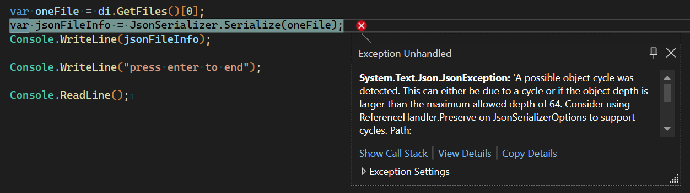

We could try some of the suggestions given in the exception message, but I'm satisfied that our DTO is an improvement over the `FileInfo` class as a transfer structure.

>For more details on serialization/deserialization read [JSON serialization and deserialization (marshalling and unmarshalling) in .NET - overview](https://learn.microsoft.com/en-us/dotnet/standard/serialization/system-text-json/overview) on the Microsoft Learn website.

### A  Little Bit of Cleanup
Ok, let's clean out the code we don't need by removing the serialization lines, including the `using System.Text.Json` line at the top. Our code to this point in `Program.CS` should look like this:
```C#
string path = @"C:\StarDriveData\";

List<DirectoryItem> directoryItems = new();

DirectoryInfo di = new DirectoryInfo(path);
if (di.Exists)
{
    FileInfo[] files = di.GetFiles();

    foreach (var f in files)
    {
        var directoryItem = new DirectoryItem() { Name = f.Name, IsDirectory = false, Path = f.FullName, LastModified = f.LastWriteTime, Size = f.Length };
        directoryItems.Add(directoryItem);
    }

    DirectoryInfo[] folders = di.GetDirectories();
    foreach (var f in folders)
    {
        var directoryItem = new DirectoryItem() { Name = f.Name, IsDirectory = true, Path = f.FullName, LastModified = f.LastWriteTime };
        directoryItems.Add(directoryItem);
    }
}

foreach (var d in directoryItems)
{
    Console.WriteLine($"{d.Name} - {d.IsDirectory}");
}

Console.WriteLine("press enter to end");
Console.ReadLine();
```

Let's also add a couple of lines to the end of our program to prevent our console app from closing after it is done executing. This will make more sense in our next section.

```C#
Console.WriteLine("press enter to end");
Console.ReadLine();
```
Ok. That is good for now. **Please run it again to check that it compiles and so we have the build artifacts we need for the next section.**

### Compile to Single, Self-Contained Executeable for Deployment
First, let's take a look at what happens when we compile our application. So far, we have used the `Play` button to run our application in Debug mode, but eventually we will want to compile our application for Release.

We can examine our compiled artifacts by right-clicking on the project node in the Solution Explorer (StarDrive.Agent) and selecting the menu option `Open Folder in File Explorer`.

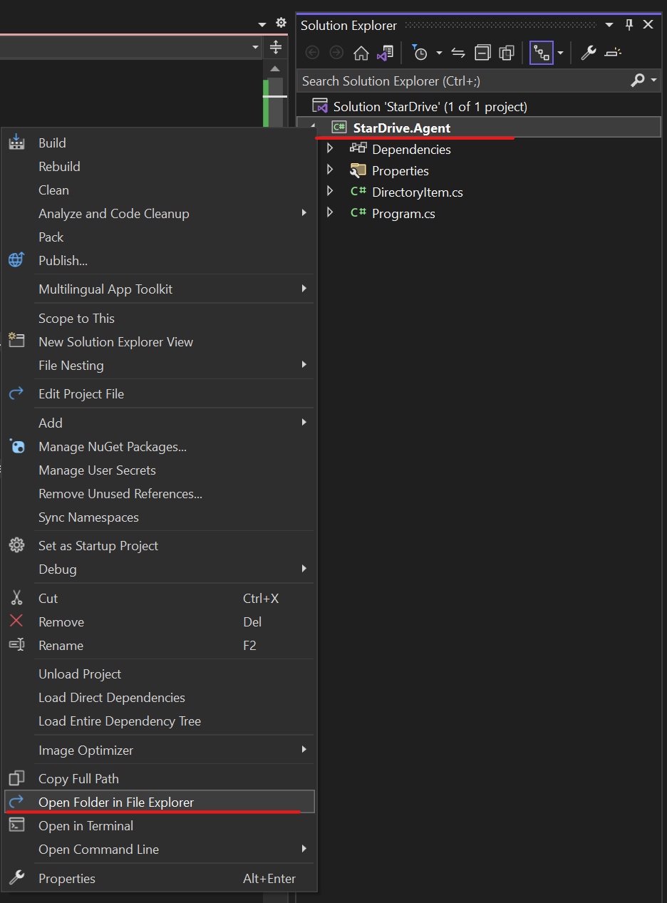

Upon opening, you should see the contents of the project folder like this:

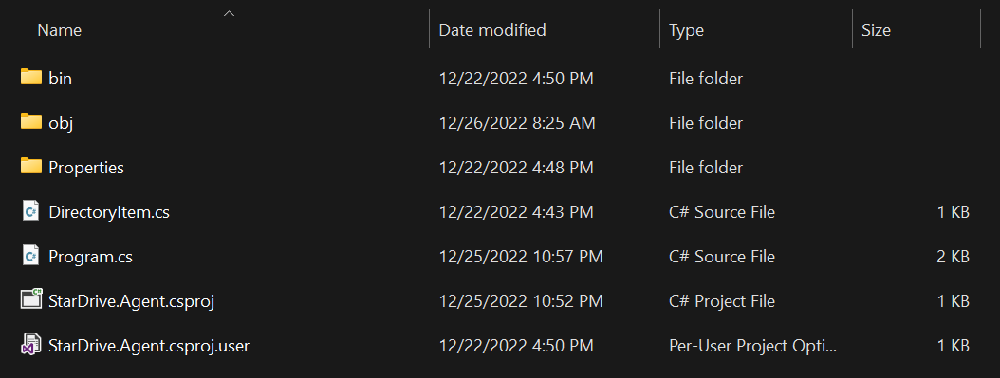

Continue navigating further by clicking into the `bin` folder, then the `Debug` folder, `.Net 7.0` (as of this writing) folder until you reach the artifacts of the compiler.

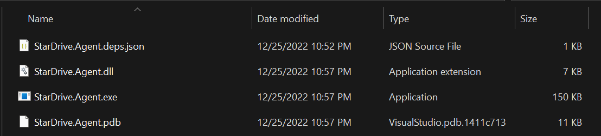

You should see about 4 files in the folder all beginning with the name StarDrive.Agent. One of those files is the `.EXE` or executable file. See what happens when you double-click to run it.

>Make sure you compiled the application with our latest changes before trying to run it or you may not get what you expected. If you forgot, right click the project in Solution Explorer and select `Build` to compile.

It should have run just as when we used the `Play` button and it should have launced a console window. To close it, hit the `Enter` key.

This is great. Currently, if we wanted to run this on another machine, we would need to copy the `.exe` file and the accompanying `.dll` file as well. The other files aren't strictly necessary, but the `.pdb` file can be useful for debugging a compiled application. It basically maps back to our source code in "friendly" details when debugging.

Let's test our assumption and simulate copying the files to a new machine next!

#### Use Windows Sandbox
Windows 11 and certain versions of Windows 10 have a nice feature known as Windows Sandbox (not supported on Home edition). This is a  ightweight desktop, self-cleaning VM (virtual machine) where we can test our application. You must enable it to use it.

>Learn more about [Windows Sandbox](https://learn.microsoft.com/en-us/windows/security/threat-protection/windows-sandbox/windows-sandbox-overview) on Microsoft Learn, including how to enable it.

Assuming you have it enabled, hit the `Windows` key on your keyboard and type `Sandbox` and click on the `Windows Sandbox` icon.

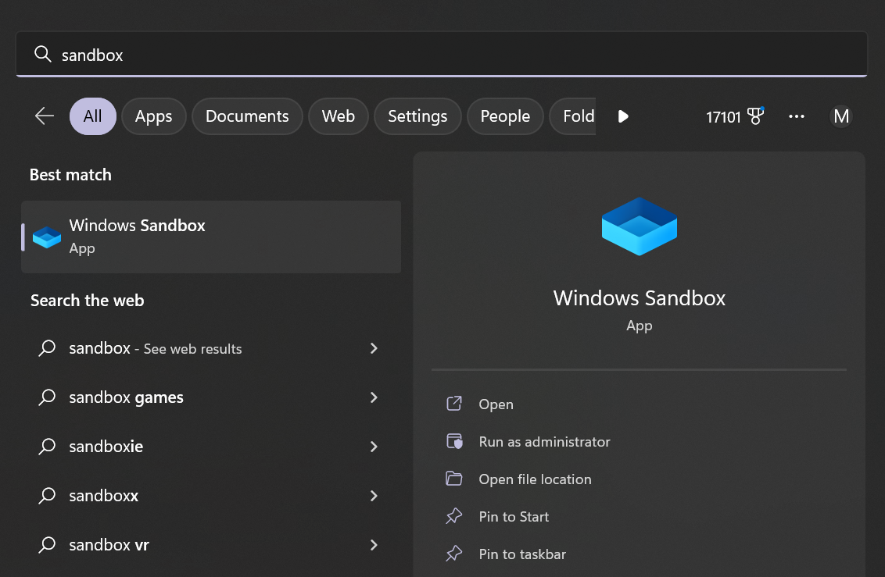

Once it launches, you will see a window open with a clean desktop instance running:

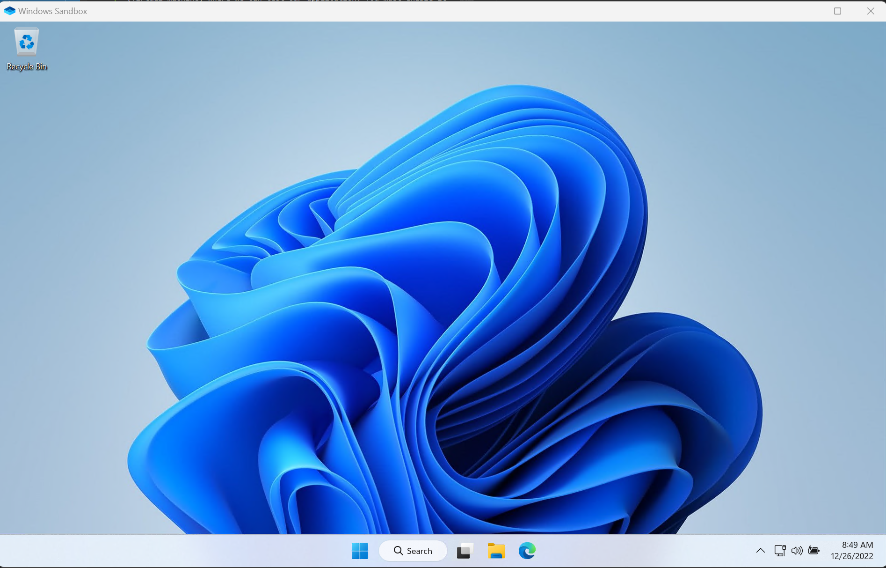

To test our files, simply copy and paste into the sandbox, directly onto the desktop. Then, try to run the application by double clicking on the `.exe` file.

What happened? You probably can't see anything happen. Maybe a quick flash, and then the console window closes.

If you launch a `cmd` window and navigate to the desktop folder (`cd desktop`) then run the `StarDrive.Agent.exe` from the command line, you will discover the problem:

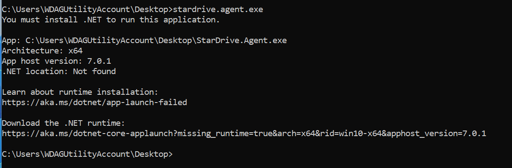

The application can't run because it depends on the .NET runtime which hasn't been installed on our new machine/sandbox. To solve this, we could download and install the runtime as suggested in the command window however, we have some other compile options we can try.

Returning to Visual Studio, right-click the project (StarDrive.Agent) and select `Publish` from the menu. If this is your first time through, a wizard dialog box will appear:

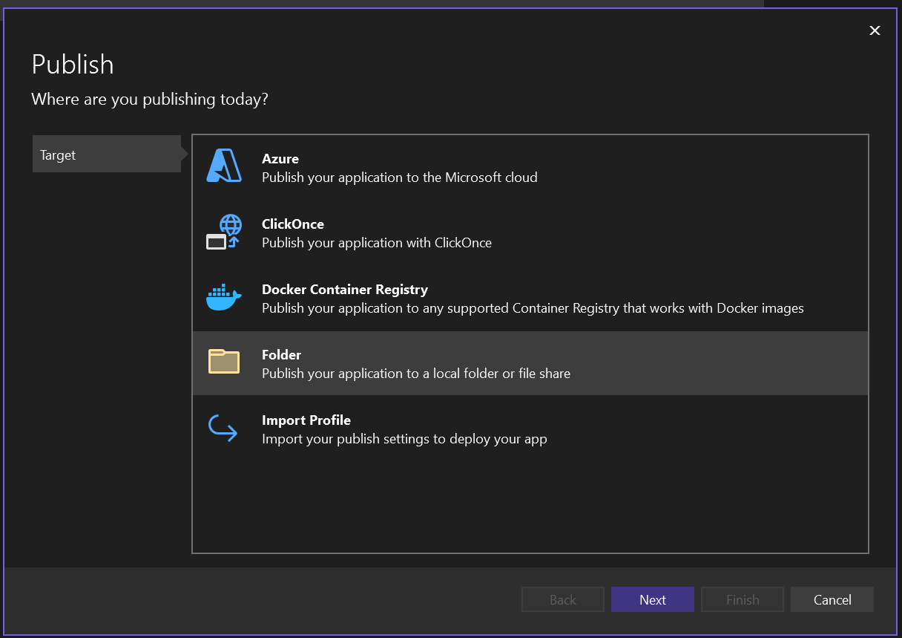

Select the `Folder` option for the "Target" then click the Next button.

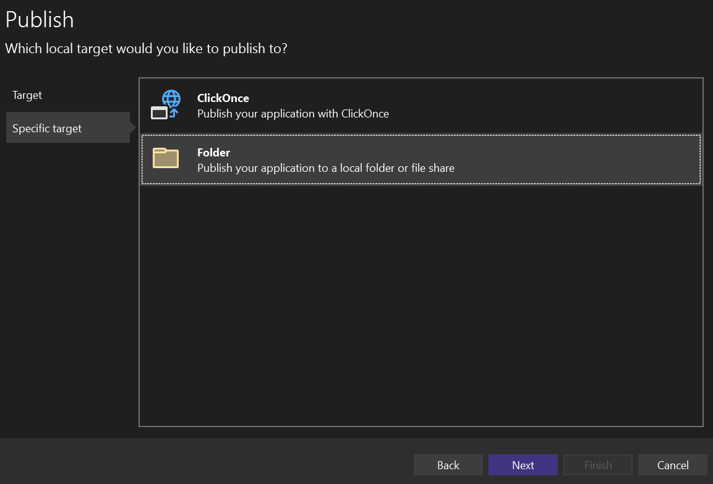

Again, select `Folder` for the "Specific Target" rather than the ClickOnce option.

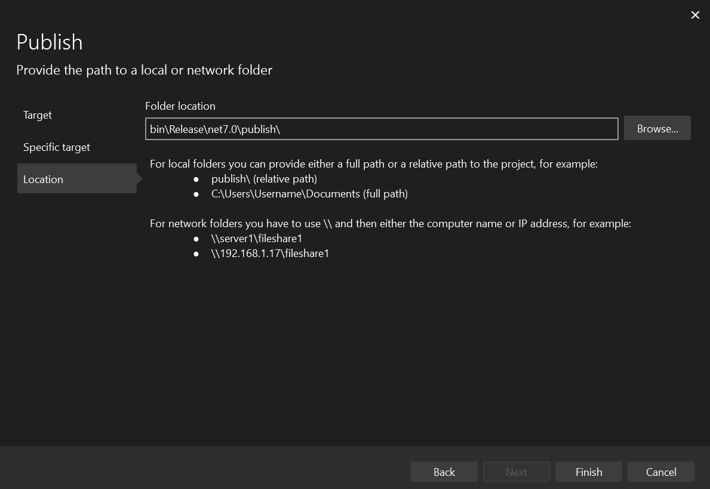

Finally, you will prompted to specify an output location. For now we will leave the default, but changing this can be helpful to make it easier to find your published artifacts. (The default is buried pretty deep within your project folder.) Click Finish to complete setting up the publish definition.

Click close on the final dialog which tells you that it created an .xml file with the publish profile definition into your solution.

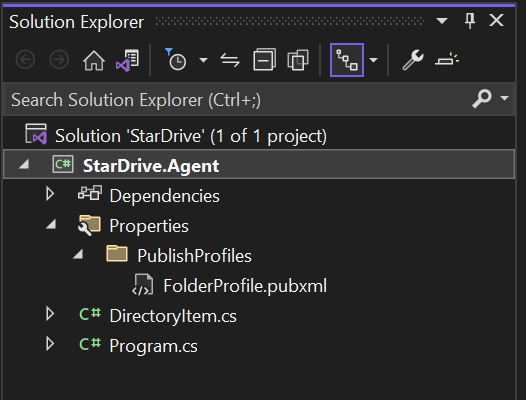

Notice that you have a Properties -> PublishProfiles -> FolderProfile.pubxml file in your solution explorer now. Also you will have a new publish tab in Visual Studio:

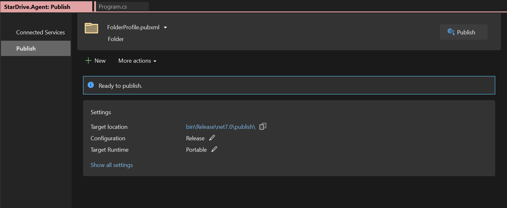

If we click the `Publish` button in the upper right hand corner, it will create our build artifacts at the target location, but let's not do that just yet. 

First, click the `Show all settings` link at the bottom of the Settings panel in the Publish tab to pop a settings dialog and changed the `Deployment mode` from `Framework dependent` to `Self-contained` and click save.

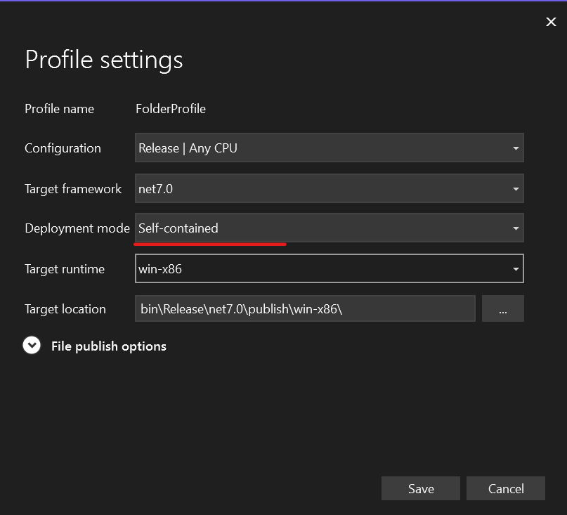

Now click the `Publish` button in the upper right corner and be patient as it builds. Once it completes, the message should show a green box with a link to open the publish artifacts folder labeled `Open folder`. 

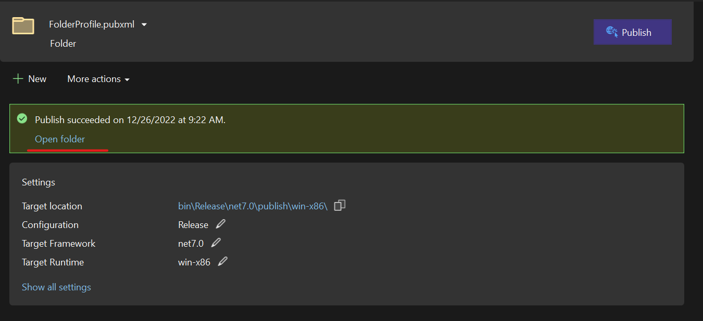

Click the `Open folder` link and examine the contents.

Yikes! If your output is like mine, there are over 180 files in this folder! And yes, we would need to copy the entire folder to our sandbox for it to run. This compile option basically copies the entire .NET runtime and .dll files to your publish folder so you can run your application. This can be helpful in certain scenarios, but in our scenario makes things a bit cumbersome.

Let's return to the Profile settings dialog and examine some other options. Click the `Show all settings` link again to launch the dialog.

This time, let's expand the `File publish options` according and see what is hiding beneath it.

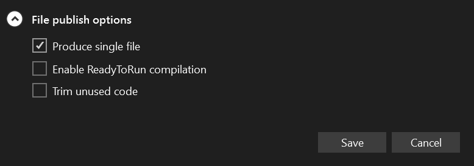

There are currently 3 options available in the dialog box:
1. Produce single file
2. Enable ReadyToRun compilation
3. Trim unused code

We definitely want to check the first box. Produce single file will statically compile all our dependent .dll files into a single executable file. It will be large, for sure, but much easier to manage.

The `Enable ReadyToRun compilation` option helps improve startup time for the application by using AoT (Ahead of Time) compilation. You can experiment with this if you would like. Our application doesn't really depend on fast startup times, so we don't really need it.

`Trim unused code` will help shrink the size of the executable file by attempting to determine which dependencies we are NOT using in our code. This can be a bit risky with reflection heavy code as the compiler may not understand what true dependencies we have, but again, feel free to experiment with it.

For now, at least check `Produce single file` and click save, then click our Publish button again and be even more patient as we wait for the compiler.

When it is complete, open the publish folder and check the artifacts. This time we should only see two files:
1. StarDrive.Agent.exe
2. StarDrive.Agent.pdb

Copy the `.exe` file to the sandbox and try running it again. This time, it should work.

>Note: if it doesn't work, it is likely because you are missing the target directory from your local machine. Simply copy the target directory from your devbox to the Windows Sandbox instance and try it again.

Note the file size of your `.exe` file. Mine is approximately 60mb in size. I also tried it with the other two options checked and it shrunk my file to about 15mb in size. If you use the trim option, it is a good idea to check it in the Sandbox to make sure it still works.


>Learn more about deployment models with [.NET application publishing overview](https://learn.microsoft.com/en-us/dotnet/core/deploying/) on Microsoft Learn.


1. Compile to executable/single file
2. Move our DTO to a Shared Library
3. Make the console app a Windows Service friendly app
4. Add SignalR code to connect to a server, however, we don't have a server and we would have build that now....which is a lot

