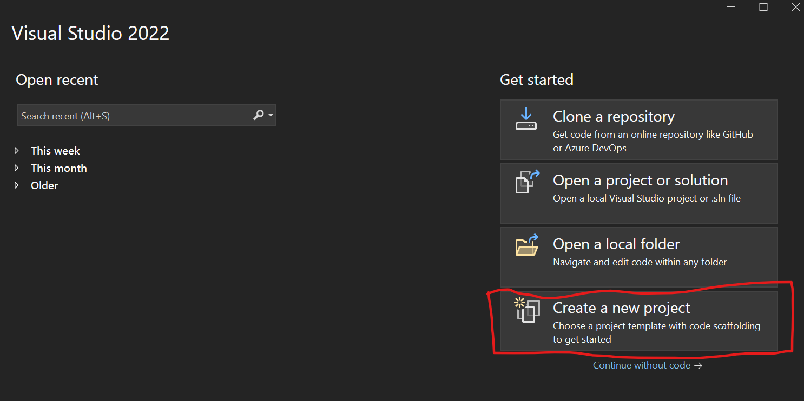
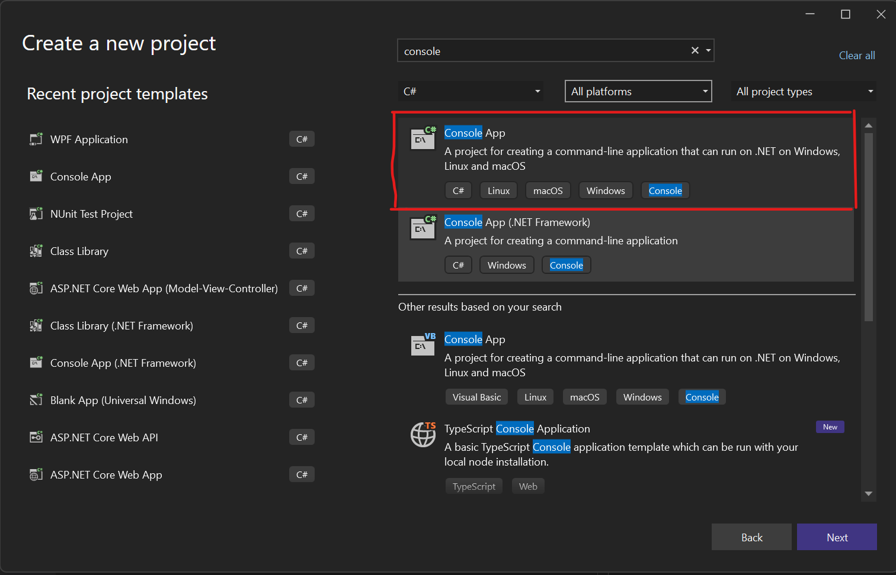
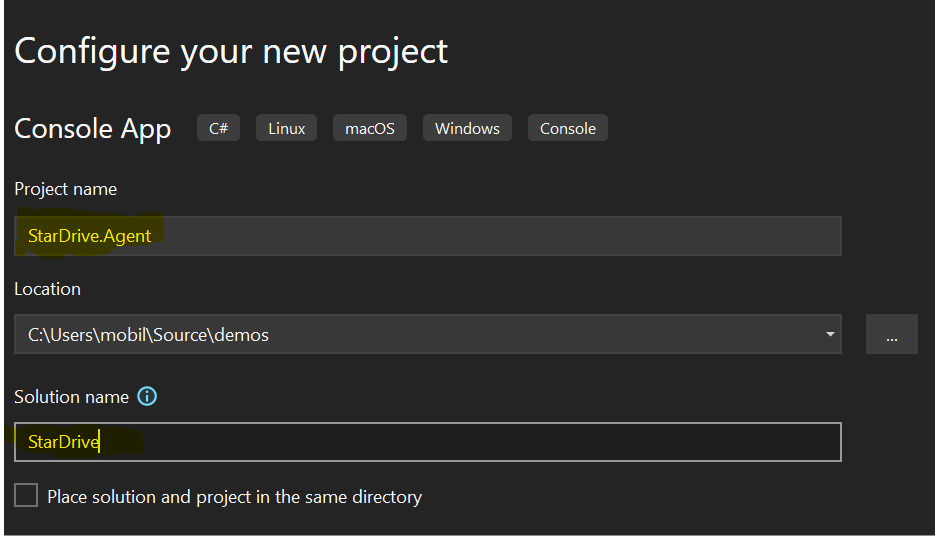
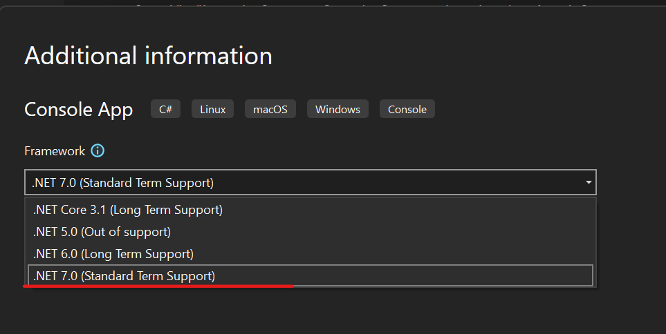
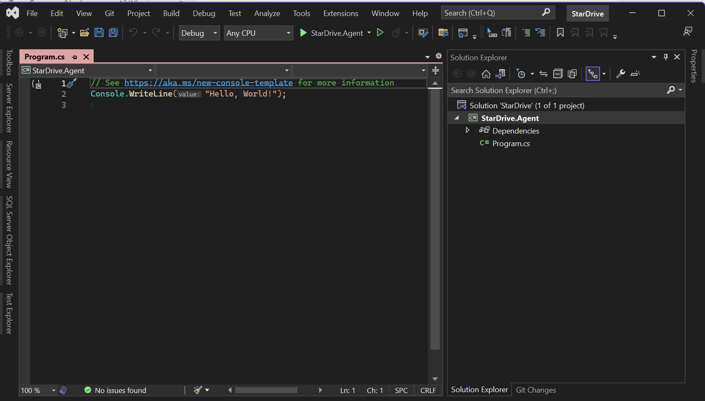
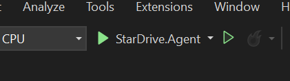
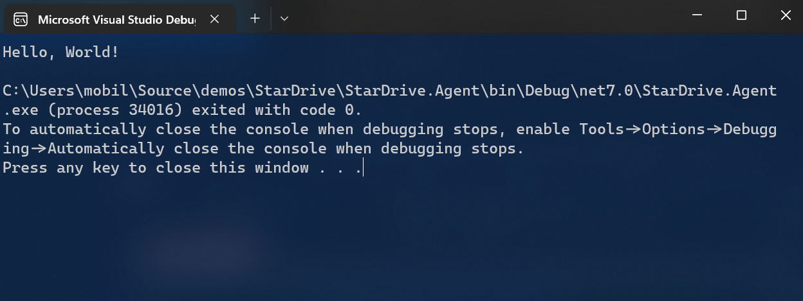

## StarDrive - Building the Client Agent
Let's begin by building the client agent for the remote machine. As of this writing, the current version of .Net Core is .NET 7 and Visual Studio 2022 is the latest IDE version.

### Create the Project

1. Open Visual Studio (2022).

2. Select **"Create a new project"**



3. The templates dialog will open. There are a lot of templates to choose from and it can be overwhelming. You can use the filters and the searchbox to reduce the options. In the searchbox, type `"console"`. Additionally, select `"C#"` as the language from the language drop down box just below the searchbox.



4. Choose the `Console App` for .Net (not the older .Net Framework version)

5. Choose a name for the application. In this case, I chose `StarDrive.Agent`. Make sure the solution name is simply `StarDrive` to distinguish it from the StarDrive.csproj project file. Click **Next** to continue.



6. Choose a version of .NET to target. We will want to target the latest as of this writing, version 7. We will leave the checkbox unchecked for "Do not use top level statements". Then click CREATE.




7. This will generate our project from the base template and place the project inside of a solution. In this screenshot, notice that the project opened the Program.cs file, which is the starting point for our application.



We now have a project created!

### First Run
Let's run the project and make sure everything happens as expected.  To (build) and run the project, simply press the Play button on the toolbar:



This will build the app, and run it once it has compiled.



Not too exciting here, but notice that it output the text "Hello, World!" That's good, it means it worked.


### Directory Browsing Code:
One of the key responsiblities for our StarDrive app will be to browse the directories of the remote machine. Specifically, it will be the responsiblity of the `Agent` console application.

There are a couple of ways to browse directories with C# and .Net Core. Using the `System.IO` namespace, we can employ some static methods to do our work. Perhaps you have seen code like this before?

```C#
string path = @"C:\StarDriveData\";

string[] folders = System.IO.Directory.GetDirectories(path);
string[] files = System.IO.Directory.GetFiles(path);

foreach (var folder in folders)
{
    Console.WriteLine(folder);
}

foreach (var file in files)
{
    Console.WriteLine(file);
}
```
The `GetDirectories()` and `GetFiles()` methods return an array of strings with the full path of the directories or files located immediately at the designated path.

If you were to run the code above, you might see output that look like this:

```cmd
C:\StarDriveData\Documents
C:\StarDriveData\Music
C:\StarDriveData\Pictures
C:\StarDriveData\Videos
C:\StarDriveData\SampleText.txt
```

The trouble with relying on these two methods is that they don't offer me more details such as FileSize, LastModifiedDate, etc. To get the information we will need, we can use another `class` called `DirectoryInfo`. This class provices similar data, except it also includes FileSize, LastModifiedMethod and more. Let's rewrite the above code to use DirectoryInfo:

```C#
string path = @"C:\StarDriveFiles\";

DirectoryInfo di = new DirectoryInfo(path);
if (di.Exists)
{
    var files = di.GetFiles();
    foreach(var f in files)
    {
        Console.WriteLine(f.Name);
    }

    var folders = di.GetDirectories();
    foreach(var f in folders)
    {
        Console.WriteLine(f.Name);
    }
}
```


```C#
internal class DirectoryItem
{
    public bool IsDirectory { get; set; }
    public string? Name { get; set; }
    public string? Path { get; set; }
    public DateTime LastModified { get; set; }
    public long Size { get; set; }
}
```

```C#
List<DirectoryItem> directoryItems= new();

DirectoryInfo di = new DirectoryInfo(path);
if (di.Exists)
{
    var files = di.GetFiles();
    foreach(var f in files)
    {
        var directoryItem = new DirectoryItem() { Name = f.Name, IsDirectory = false, Path = f.FullName, LastModified = f.LastWriteTime, Size=f.Length };
        directoryItems.Add(directoryItem);
    }

    var folders = di.GetDirectories();
    foreach(var f in folders)
    {
        var directoryItem = new DirectoryItem() { Name = f.Name, IsDirectory=true, Path=f.FullName, LastModified=f.LastWriteTime };
        directoryItems.Add(directoryItem);
    }
}
```

1) Make the console app a Windows Service friendly app
2) Add SignalR code to connect to a server, however, we don't have a server and we would have build that now....which is a lot

