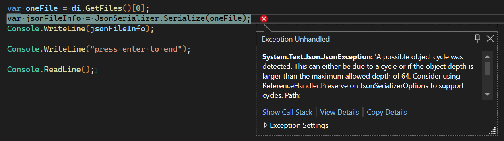

## StarDrive Building the Client Agent - Part 3

### Create a Simple DTO (Data Transfer Object)
The goal of our remote app is to send data back to the web server so we can browse the file system. We could try to send the `FileInfo` class over the network to the web server, but it is not an insignificant class.

If we examine the `FileInfo` class in our locals window while debugging, we can see we have a pretty big object on our hands.


So rather than send such a heavy object to the server, let's create a simpler version. 

Add a class called `DirectoryItem.cs` to the solution explorer (in the root should be sufficient for now). The class will be a simple `POCO` class, or Plain Old C# Object.

```C#
internal class DirectoryItem
{
    public bool IsDirectory { get; set; }
    public string? Name { get; set; }
    public string? Path { get; set; }
    public DateTime LastModified { get; set; }
    public long Size { get; set; }
}
```

This will provide us with a nice simple structure that can be serialized to Json or another serializer to send across the wire more efficiently. This is known as a DTO, or Data Transfer Object. It is optimized for serializing and transport.

Next, let's modify the directory browsing code to not just write to the console, but populate a list of `DirectoryItems` for transport:

```C#
List<DirectoryItem> directoryItems= new();

DirectoryInfo di = new DirectoryInfo(path);
if (di.Exists)
{
    FileInfo[] files = di.GetFiles();
    foreach(var f in files)
    {
        var directoryItem = new DirectoryItem() { Name = f.Name, IsDirectory = false, Path = f.FullName, LastModified = f.LastWriteTime, Size=f.Length };
        directoryItems.Add(directoryItem);
    }

    DirectoryInfo[] folders = di.GetDirectories();
    foreach(var f in folders)
    {
        var directoryItem = new DirectoryItem() { Name = f.Name, IsDirectory=true, Path=f.FullName, LastModified=f.LastWriteTime };
        directoryItems.Add(directoryItem);
    }
}
```
Notice the primary difference between `FileInfo[]` and `DirectoryInfo[]` is that files have a `length` or size to them (in bytes) and we mark the `IsDirectory` property in our DTO accordingly.

If you want to see the effect, you can add this code below to the end of the above code and run it:

```C#
foreach (var d in directoryItems)
{
    Console.WriteLine($"{d.Name} - {d.IsDirectory}");
}
```

### Compare Serialized Objects
To demonstrate the value of the DTO, we can quickly add a little code to examine how an object may look when it is serialized to JSON. Leveraging the `System.Text.Json` serializer, let's serialize both a `FileInfo` object and our simpler `DirectoryInfo` object and compare.


```C#
var jsonDirectoryItem = JsonSerializer.Serialize(directoryItems[0]);
Console.WriteLine(jsonDirectoryItem);

var oneFile = di.GetFiles()[0];
var jsonFileInfo = JsonSerializer.Serialize(oneFile);
Console.WriteLine(jsonFileInfo);
```

The singular DirectoryItem (our DTO object) serializes nicely to this:

```json
{
    "IsDirectory":false,
    "Name":"SampleText.txt",
    "Path":"C:\\StarDriveData\\SampleText.txt",
    "LastModified":"2022-12-23T23:55:38.8980915-07:00",
    "Size":64
}
```

However, we get an error when trying to serialize the `FileInfo` class.



We could try some of the suggestions given in the exception message, but I'm satisfied that our DTO is an improvement over the `FileInfo` class as a transfer structure.

>For more details on serialization/deserialization read [JSON serialization and deserialization (marshalling and unmarshalling) in .NET - overview](https://learn.microsoft.com/en-us/dotnet/standard/serialization/system-text-json/overview) on the Microsoft Learn website.

### A  Little Bit of Cleanup
Ok, let's clean out the code we don't need by removing the serialization lines, including the `using System.Text.Json` line at the top. Our code to this point in `Program.CS` should look like this:
```C#
string path = @"C:\StarDriveData\";

List<DirectoryItem> directoryItems = new();

DirectoryInfo di = new DirectoryInfo(path);
if (di.Exists)
{
    FileInfo[] files = di.GetFiles();

    foreach (var f in files)
    {
        var directoryItem = new DirectoryItem() { Name = f.Name, IsDirectory = false, Path = f.FullName, LastModified = f.LastWriteTime, Size = f.Length };
        directoryItems.Add(directoryItem);
    }

    DirectoryInfo[] folders = di.GetDirectories();
    foreach (var f in folders)
    {
        var directoryItem = new DirectoryItem() { Name = f.Name, IsDirectory = true, Path = f.FullName, LastModified = f.LastWriteTime };
        directoryItems.Add(directoryItem);
    }
}

foreach (var d in directoryItems)
{
    Console.WriteLine($"{d.Name} - {d.IsDirectory}");
}

Console.WriteLine("press enter to end");
Console.ReadLine();
```

Let's also add a couple of lines to the end of our program to prevent our console app from closing after it is done executing. This will make more sense in our next section.

```C#
Console.WriteLine("press enter to end");
Console.ReadLine();
```
Ok. That is good for now. **Please run it again to check that it compiles and so we have the build artifacts we need for the next section.**