### Deployment Models
First, let's take a look at what happens when we compile our application. So far, we have used the `Play` button to run our application in Debug mode, but eventually we will want to compile our application for Release.

We can examine our compiled artifacts by right-clicking on the project node in the Solution Explorer (StarDrive.Agent) and selecting the menu option `Open Folder in File Explorer`.

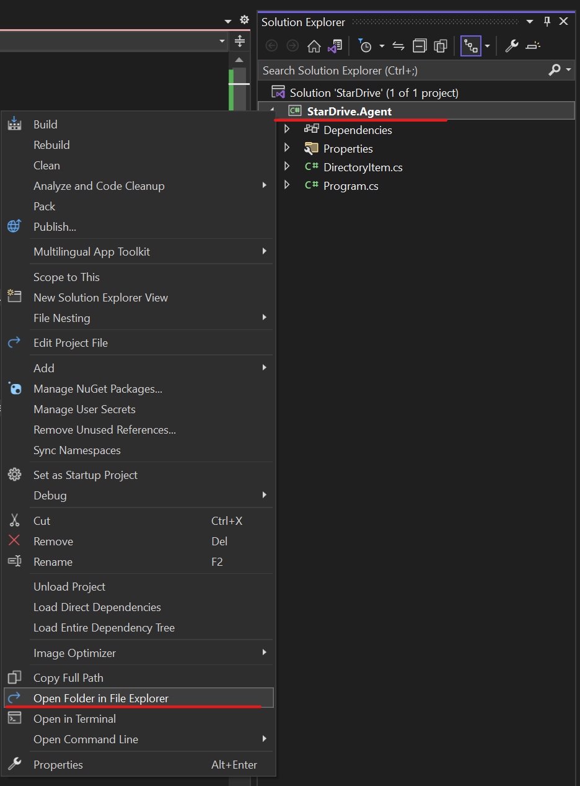

Upon opening, you should see the contents of the project folder like this:

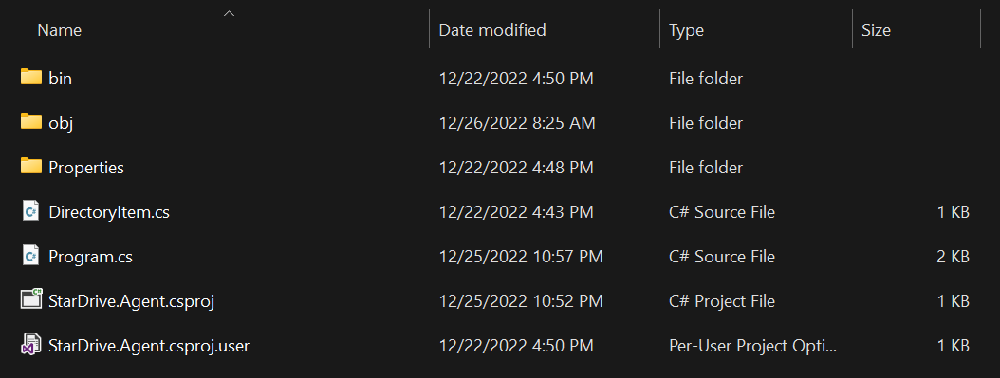

Continue navigating further by clicking into the `bin` folder, then the `Debug` folder, `.Net 7.0` (as of this writing) folder until you reach the artifacts of the compiler.

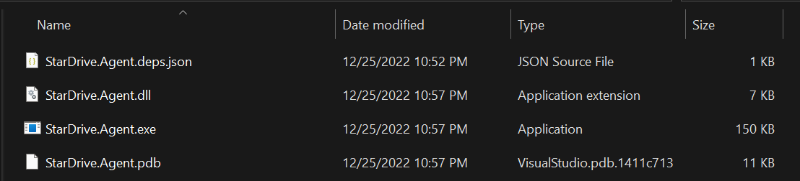

You should see about 4 files in the folder all beginning with the name StarDrive.Agent. One of those files is the `.EXE` or executable file. See what happens when you double-click to run it.

>Make sure you compiled the application with our latest changes before trying to run it or you may not get what you expected. If you forgot, right click the project in Solution Explorer and select `Build` to compile.

It should have run just as when we used the `Play` button and it should have launced a console window. To close it, hit the `Enter` key.

This is great. Currently, if we wanted to run this on another machine, we would need to copy the `.exe` file and the accompanying `.dll` file as well. The other files aren't strictly necessary, but the `.pdb` file can be useful for debugging a compiled application. It basically maps back to our source code in "friendly" details when debugging.

Let's test our assumption and simulate copying the files to a new machine next!

#### Use Windows Sandbox
Windows 11 and certain versions of Windows 10 have a nice feature known as Windows Sandbox (not supported on Home edition). This is a  ightweight desktop, self-cleaning VM (virtual machine) where we can test our application. You must enable it to use it.

>Learn more about [Windows Sandbox](https://learn.microsoft.com/en-us/windows/security/threat-protection/windows-sandbox/windows-sandbox-overview) on Microsoft Learn, including how to enable it.

Assuming you have it enabled, hit the `Windows` key on your keyboard and type `Sandbox` and click on the `Windows Sandbox` icon.

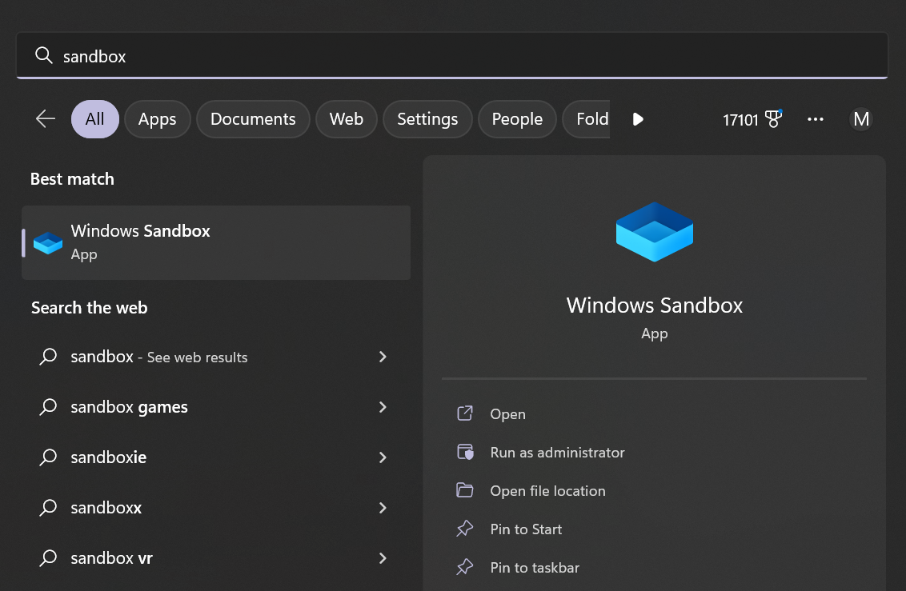

Once it launches, you will see a window open with a clean desktop instance running:

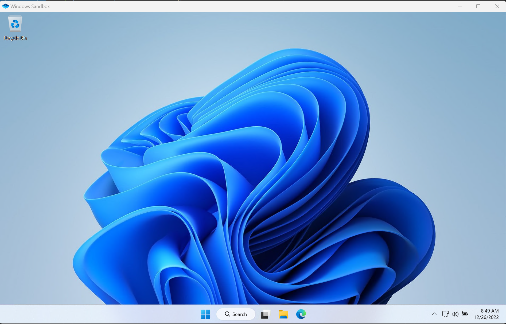

To test our files, simply copy and paste into the sandbox, directly onto the desktop. Then, try to run the application by double clicking on the `.exe` file.

What happened? You probably can't see anything happen. Maybe a quick flash, and then the console window closes.

If you launch a `cmd` window and navigate to the desktop folder (`cd desktop`) then run the `StarDrive.Agent.exe` from the command line, you will discover the problem:

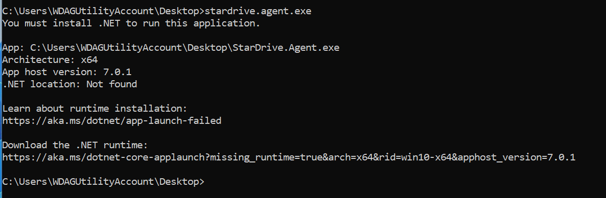

The application can't run because it depends on the .NET runtime which hasn't been installed on our new machine/sandbox. To solve this, we could download and install the runtime as suggested in the command window however, we have some other compile options we can try.

#### Compile Single File, Self-contained Executable
Returning to Visual Studio, right-click the project (StarDrive.Agent) and select `Publish` from the menu. If this is your first time through, a wizard dialog box will appear:

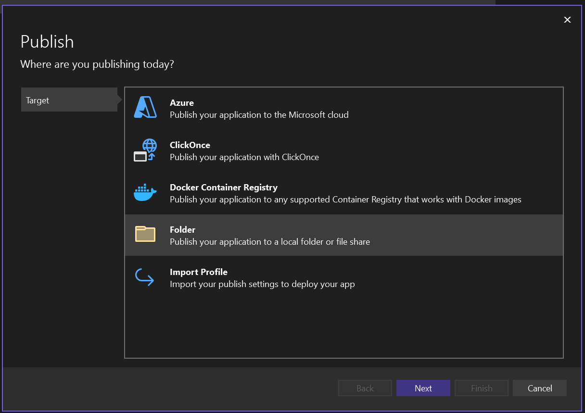

Select the `Folder` option for the "Target" then click the Next button.

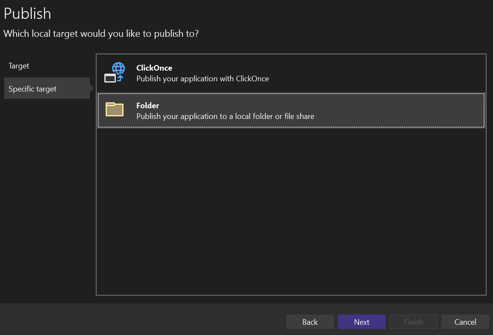

Again, select `Folder` for the "Specific Target" rather than the ClickOnce option.

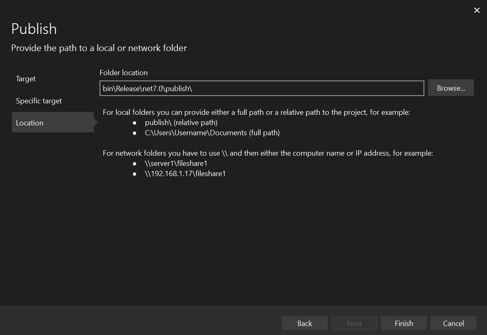

Finally, you will prompted to specify an output location. For now we will leave the default, but changing this can be helpful to make it easier to find your published artifacts. (The default is buried pretty deep within your project folder.) Click Finish to complete setting up the publish definition.

Click close on the final dialog which tells you that it created an .xml file with the publish profile definition into your solution.

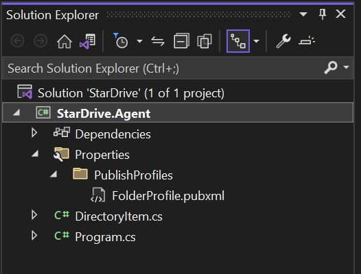

Notice that you have a Properties -> PublishProfiles -> FolderProfile.pubxml file in your solution explorer now. Also you will have a new publish tab in Visual Studio:

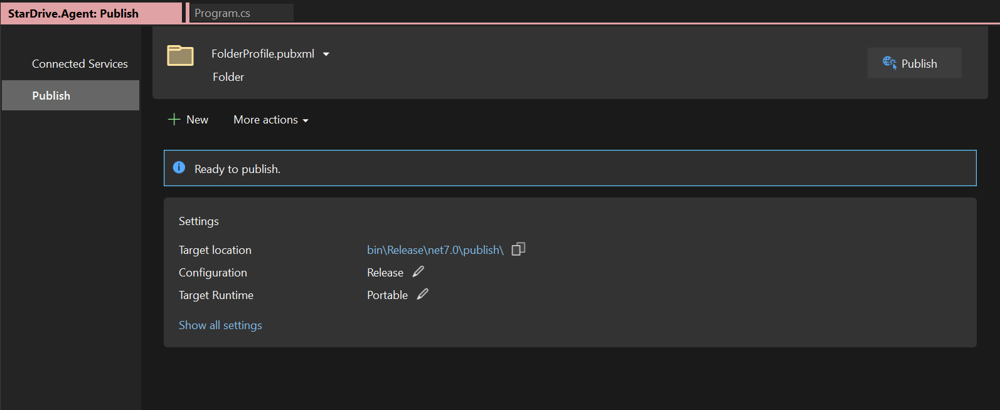

If we click the `Publish` button in the upper right hand corner, it will create our build artifacts at the target location, but let's not do that just yet. 

First, click the `Show all settings` link at the bottom of the Settings panel in the Publish tab to pop a settings dialog and changed the `Deployment mode` from `Framework dependent` to `Self-contained` and click save.

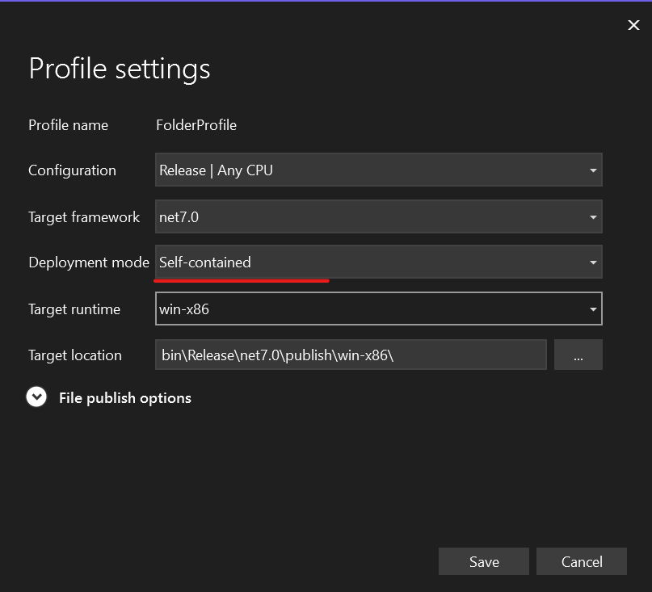

Now click the `Publish` button in the upper right corner and be patient as it builds. Once it completes, the message should show a green box with a link to open the publish artifacts folder labeled `Open folder`. 

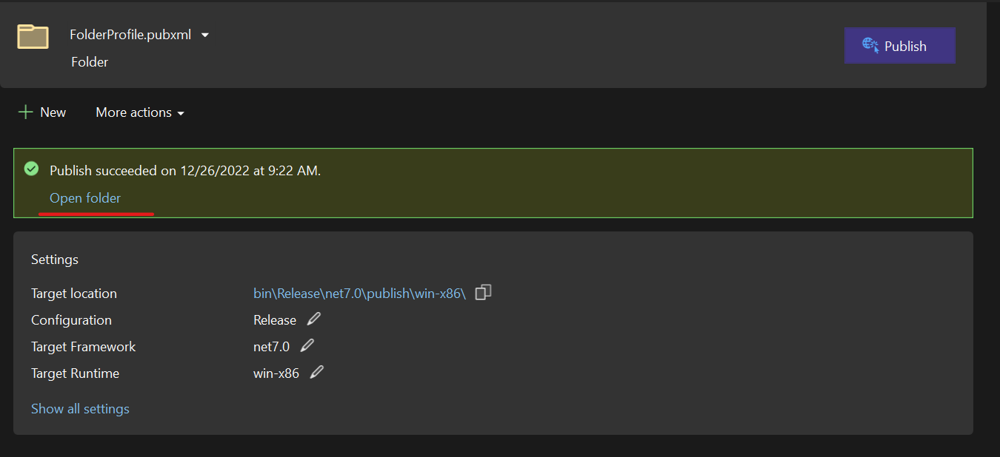

Click the `Open folder` link and examine the contents.

Yikes! If your output is like mine, there are over 180 files in this folder! And yes, we would need to copy the entire folder to our sandbox for it to run. This compile option basically copies the entire .NET runtime and .dll files to your publish folder so you can run your application. This can be helpful in certain scenarios, but in our scenario makes things a bit cumbersome.

Let's return to the Profile settings dialog and examine some other options. Click the `Show all settings` link again to launch the dialog.

This time, let's expand the `File publish options` according and see what is hiding beneath it.

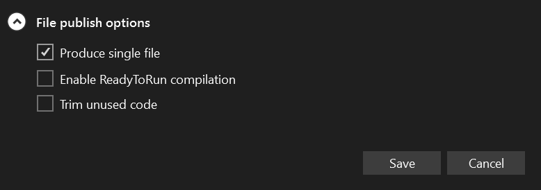

There are currently 3 options available in the dialog box:
1. Produce single file
2. Enable ReadyToRun compilation
3. Trim unused code

We definitely want to check the first box. Produce single file will statically compile all our dependent .dll files into a single executable file. It will be large, for sure, but much easier to manage.

The `Enable ReadyToRun compilation` option helps improve startup time for the application by using AoT (Ahead of Time) compilation. You can experiment with this if you would like. Our application doesn't really depend on fast startup times, so we don't really need it.

`Trim unused code` will help shrink the size of the executable file by attempting to determine which dependencies we are NOT using in our code. This can be a bit risky with reflection heavy code as the compiler may not understand what true dependencies we have, but again, feel free to experiment with it.

For now, at least check `Produce single file` and click save, then click our Publish button again and be even more patient as we wait for the compiler.

When it is complete, open the publish folder and check the artifacts. This time we should only see two files:
1. StarDrive.Agent.exe
2. StarDrive.Agent.pdb

Copy the `.exe` file to the sandbox and try running it again. This time, it should work.

>Note: if it doesn't work, it is likely because you are missing the target directory from your local machine. Simply copy the target directory from your devbox to the Windows Sandbox instance and try it again.

Note the file size of your `.exe` file. Mine is approximately 60mb in size. I also tried it with the other two options checked and it shrunk my file to about 15mb in size. If you use the trim option, it is a good idea to check it in the Sandbox to make sure it still works.

>Learn more about deployment models with [.NET application publishing overview](https://learn.microsoft.com/en-us/dotnet/core/deploying/) on Microsoft Learn.

[-> To Building StarDrive Agent Part 5](stardrive-agent-part5.md
)