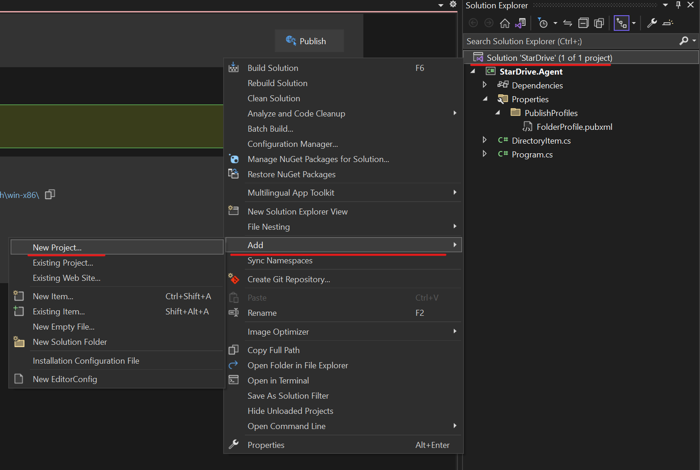
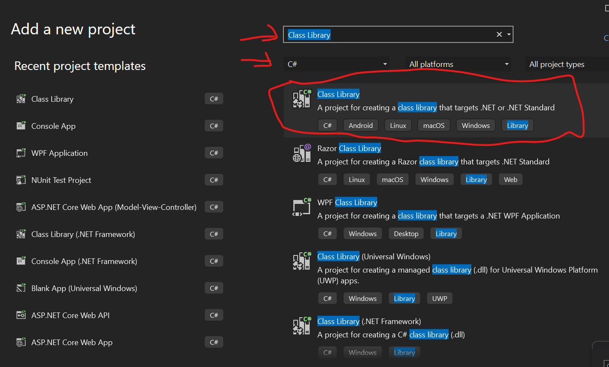
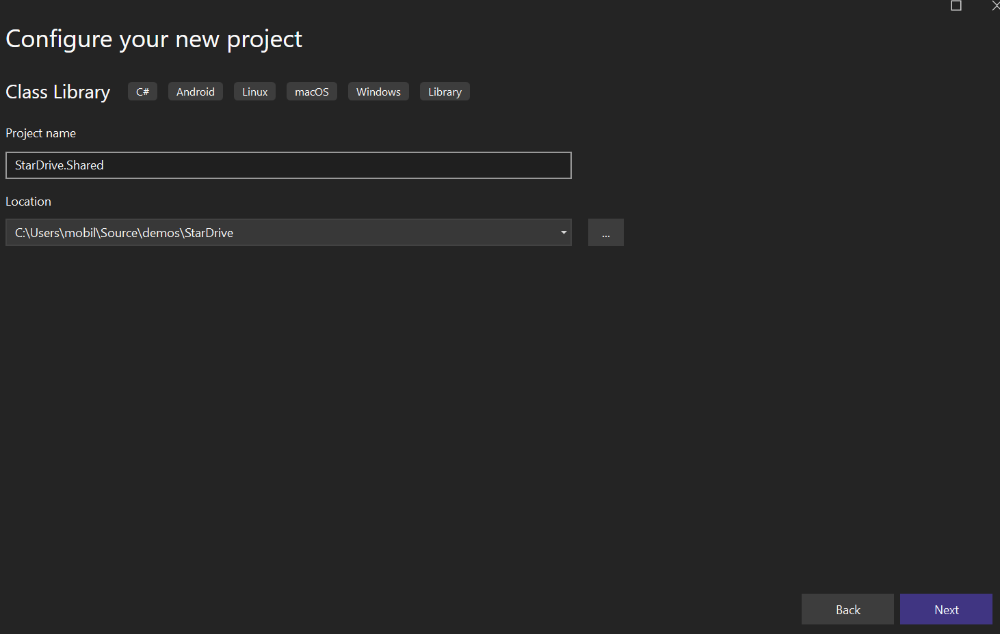
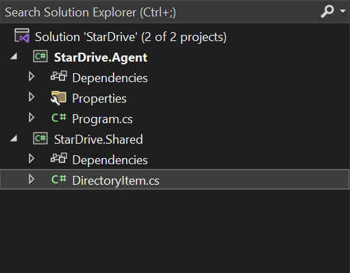
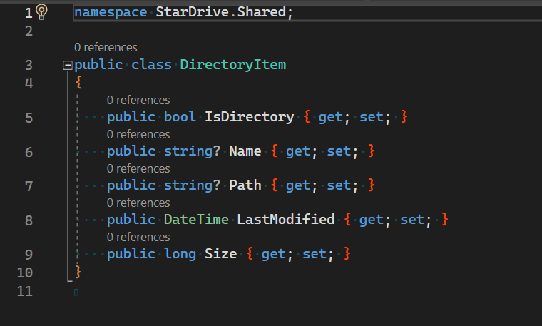
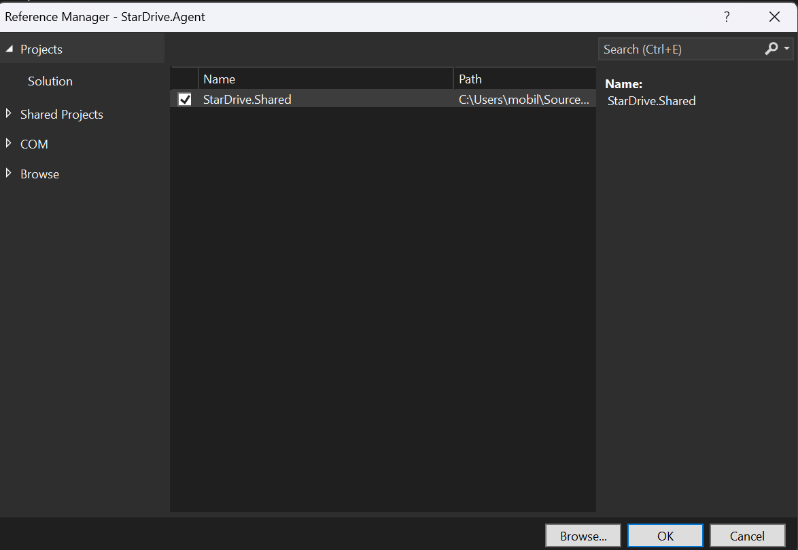

## StarDrive Building the Client Agent - Part 5

### Creating a Shared Library
Before we create our web server, we should create a shared library and move our DTO definition to the shared library as both the client agent and the web server will need to serialize/deserialize the class as the data gets transmitted. Let's begin by add a project to our solution.



1. Right-click the solution node in the solution explorer window.
2. select Add -> New Project...
3. Search for `Class Library` as the project type for C#



4. Select Class Library for .NET or .NET Standard, then click `Next`.
5. Choose `StarDrive.Shared` for the name of the new project, then click `Next`.



6. Choose .NET 7.0 (Standard Support), current as of this writing and then click `Create`.

A new project will appear below the `StarDrive.Agent` project and will be named `StarDrive.Shared`.

7. Located the `DirectoryItem.cs` file in `StarDrive.Agent` and drag it into `StarDrive.Shared`. This will make a copy in the new project.
8. Delete the original `DirectoryItem.cs` file from the Agent project.



As depicted in the image above, the Solution Explorer should show the `DirectoryItem.cs` file in Shared and now deleted from the Agent project.

Let's fix the namespace in `DirectoryItem.cs` to read:

```C#
namespace StarDrive.Shared;
```
Also change the visibility of the class from `internal` to `public`. This is necessary so that both our Agent project and our Web project will be able to use the class properly.

It should look like the screenshot below:



### Reference the Shared Project
Now we need to teach the Agent project about the existence of the Shared project. 
1. Right-click the `Dependencies` node under the StarDrive.Agent project and select `Add Project Reference...`
2. The `Add Project Reference` dialog box will appear with the `StarDrive.Shared` project exposed with a checkmark as show below:



3. Place a checkmark next to `StarDrive.Shared` then click `OK`.
4. Finally, open the `Program.cs` file in the Agent project and add a using statement for the Shared project namespace:

```C# 
using StarDrive.Shared;
```

### Summary
We have created a new shared project to house common classes that will be shared between the client and the server. We successfully moved the `DirectoryItem.cs` file from the client agent project and into the shared project. We updated the namespace and added a using statement atop the `Program.cs` file in the Agent project.

We should be able to compile and run our application and still have everything work correctly. Run the project and test it.

>Note: Normally when adding another class library, a new `.dll` build artifact would get generated, however, since we are creating a single executable file, we shouldn't notice much of a difference except a slightly larger `.exe` file.


### to do

2. Move our DTO to a Shared Library
3. Make the console app a Windows Service friendly app
4. Add SignalR code to connect to a server, however, we don't have a server and we would have build that now....which is a lot