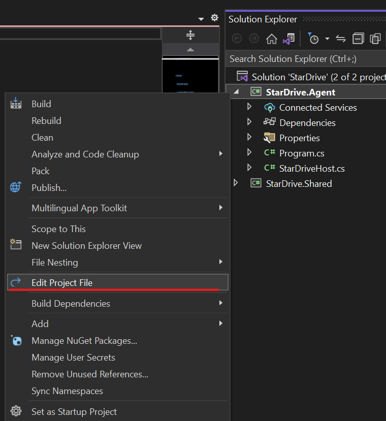

## StarDrive Building the Client Agent - Part 6

### Convert Console App to IHostedService
For our Agent, we would like it to be fairly robust and survive through restarts, power outages and crashes. The best way to accomplish this on Windows is to run our Agent as a Windows Service.

To run as a Windows Service, we need to convert our simple console app to be an `IHostedService` then register it with the Windows Service manager so it will automatically start it when the computer starts and restart if the application crashes or dies for some reason.

#### Change the SDK 
The easisiest way to make the conversion is to update the Sdk type in the .csproj file. Right click the `StarDrive.Agent` project and select `Edit Project File` option from the menu.



This will open the XML based definition file for the project. Change the top line from:

```xml
<Project Sdk="Microsoft.NET.Sdk">
```
to:

```xml
<Project Sdk="Microsoft.NET.Sdk.Worker">
```

The click save or CTRL + S to save the file.


#### Add a New StarDriveHost Class
We are going to add a new class file to our project, but before we do let's make sure that our editor is setup to use `File Scoped Namespaces`. In Visual Studio, go to Tools -> Options -> TextEditor -> C# -> Code Style then scroll through the list until the 4th section "Code block preferences". The second item, NameSpace declarations, should be changed to `File scoped`. Click OK to complete the proecess.

Let's add a new class named `StarDriveHost.cs` by right-clicking the StarDrive.Agent project and selecting "Add new class" or pressing **Shift + Alt + C**. Name it `StarDriveHost.cs` and click the **Add** button.

Next, after the class definition `StarDriveHost` add the `: IHostedService` interface. Visual Studio won't recognize it because it lives in a separate Nuget Package which we can install through the Nuget Package Manager by searching for `Microsoft.Extensions.Hosting.WindowsServices`. If you use the light bulb option directly in Visual Studio it will prompt you to install a different Nuget package as shown in the screenshot below, but we want the `WindowsServices` version:


Once the Nuget package `Microsoft.Extensions.Hosting.WindowsServices` is installed, we will need to add the Using statment at the top of the `StarDriveHost.cs` file `using Microsoft.Extensions.Hosting;`. So far, this is what our file looks like:

```C#
using Microsoft.Extensions.Hosting;

namespace StarDrive.Agent;
internal class StarDriveHost: IHostedService
{

}
```

We need to implement the interface. In Visual Studio, there is probably a red squiggly underline under IHostedService. If we use the light bulb or `CTRL + .` we can invoke the `Implement Interface` menu item. Here is the result:

```C#
using Microsoft.Extensions.Hosting;

namespace StarDrive.Agent;
internal class StarDriveHost : IHostedService
{
    public Task StartAsync(CancellationToken cancellationToken)
    {
        throw new NotImplementedException();
    }

    public Task StopAsync(CancellationToken cancellationToken)
    {
        throw new NotImplementedException();
    }
}
```

There are two main methods: `StartAsyc` and `StopAsync` which we will address momentarily.  First, let's clean out the `Program.cs` file and move the contents into the `StarDriveHost.cs` file:

```C#
private void SearchDirectory()
{
    string path = @"C:\StarDriveData\";

    List<DirectoryItem> directoryItems = new();

    DirectoryInfo di = new DirectoryInfo(path);
    if (di.Exists)
    {
        FileInfo[] files = di.GetFiles();

        foreach (var f in files)
        {
            var directoryItem = new DirectoryItem() { Name = f.Name, IsDirectory = false, Path = f.FullName, LastModified = f.LastWriteTime, Size = f.Length };
            directoryItems.Add(directoryItem);
        }

        DirectoryInfo[] folders = di.GetDirectories();
        foreach (var f in folders)
        {
            var directoryItem = new DirectoryItem() { Name = f.Name, IsDirectory = true, Path = f.FullName, LastModified = f.LastWriteTime };
            directoryItems.Add(directoryItem);
        }
    }

    foreach (var d in directoryItems)
    {
        Console.WriteLine($"{d.Name} - {d.IsDirectory}");
    }

    Console.WriteLine("press enter to end");
    Console.ReadLine();
}
```

Now let's update the `StartAsync` method in the `StarDriveHost` file to output a message to the console so we can see when the method gets called:

```C#
public Task StartAsync(CancellationToken cancellationToken)
{
    Console.WriteLine("Start Async fired");
    return Task.CompletedTask;
}
```
We need to bootstrap our host code in the `Program.cs` file. Add the following code by replacing the entire contents of the file with this:

```C#
// See https://aka.ms/new-console-template for more information
using StarDrive.Agent;

IHost host = Host.CreateDefaultBuilder(args)
    .ConfigureServices(services =>
    {
        services.AddHostedService<StarDriveHost>();
    })
    .Build();

host.Run();
```

This is a common pattern you will see in most modern .NET worker or ASP.NET projects. Because we updated the Sdk to a worker project, we don't need to add any `Using` statments to the file. They have been added to a global using file for this Sdk type.

Let's run the project and see what happens.


Notice in the console ouput, the first line reports a "Start Async fired" message, followed by some `info` logging statements from the Hosting Lifetime. This is good. We see that our application is now a Worker project, upgraded from a simple Console application.

As currently constructed, this project is compatible with Windows, Linux and Mac and should run in any environment once compiled and targeted for those environments. However, we want this to be specifically constructed to be run as a Windows Service. We already imported the nuget package `Microsoft.Extensions.Hosting.WindowsServices` so all we need to do is modify our `Program.cs` file with an additional extension method (`.UseWindowsService()`) on the builder like this:

```C#
IHost host = Host.CreateDefaultBuilder(args)
    .UseWindowsService(config =>
    {
        config.ServiceName = "StarDrive Agent Service";
    })
    .ConfigureServices(services =>
    {
        services.AddHostedService<StarDriveHost>();
    })
    .Build();
```

The `config.ServiceName = "StarDrive Service";` code sets the Service Name. You can provide any descriptive name here, but "StarDrive Agent Service" is pretty descriptive.

We can still run the project as we would a console application and the Hosting environment will run exactly the same. The difference is that we can now register it with Windows Services and it will get all the benefits of running as a service.

To do this, we can run the following command in powershell or a command prompt (as Administrator):

```powershell
> sc create "StarDrive Agent" binPath= "C:\Repos\StarDrive\StarDrive.Agent\bin\Release\net7.0\publish\win-x86\StarDrive.Agent.exe" start=auto
```

The `binPath` should point to the location of your "released" version of the application. Remember from earlier when we used the publish option to create a single, self-contained executable. We can run the publish command again from the menu by right-clicking the project and selecting the `Publish` menu option.

After running the powershell command, you should see a success message like this:

```powershell
[SC] CreateService SUCCESS
```

Now let's examine the Windows Services Management Console. From Windows Search, type `Services` as depicted in the screenshot below:


If we find "StarDrive Agent Service" in our list of services, this is what we should see: 


You can double click the entry and get a dialog box that looks like this:


Although we used the command line to set the startup type to Automatic, which means whenever we restart the computer the Agent will automatically startup even if no one logs into the machine, initially, it isn't running. We can click the `Start` button to run the app as a service. We won't see any console window, but it will be running as a background service.

To remove the Windows Service use the following command:

```powershell
sc delete "StarDrive Agent Service"
```

Be sure that the service is stopped before attempting to delete it.


#### Additional information
For more information about SC command options, please see 
[SC Command reference - Microsoft Learn](https://learn.microsoft.com/en-us/windows-server/administration/windows-commands/sc-create)


To learn more about Worker Service, IHostedInterface please visit Microsoft Learn:
[Worker Service - IHostedInterface - Microsoft Learn](https://learn.microsoft.com/en-us/dotnet/core/extensions/timer-service)


4. Add SignalR code to connect to a server, however, we don't have a server and we would have build that now....which is a lot