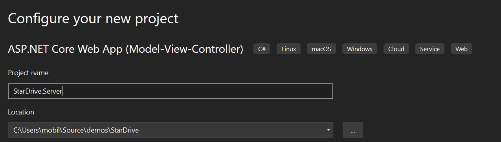

## StarDrive - Building the Server - Part 1
It is time to setup the server. Our server will be responsible for serving up Web pages and the User Interface for our StarDrive application. It will need to display the remote files from the StarDrive Agent Service.

Additionally, it will need to be a `SignalR Hub`. SignalR is a library that primarily relies upon bi-directional Web Sockets for communication between a server and a client. In our case, the Agent will make a connection to a known server location and establish a 2 way communication channel. Then each side can call the other when needed. 

This 2 way communication differs from the regular "Request" and "Response" model for web sites. Under HTTP, the browser or clients make requests of the server and it answers those requests in the form of a response. However, the server (typcally) cannot push or pull data from the browser or client without an incoming request first.

SignalR and the underlying Web Socket protocol <u>_can_</u> allow the server to make a request of the client. We will use this to our advantage to query the remote agent for information about the file system.

### Adding the StarDrive.Server project
We need to add a new `ASP.NET Core Web App (Model-View-Controller)` project to our solution. 

First, right-click the solution and select the `Add -> New Project` option from the menu as show in the screen capture below:

After the dialog appears, search for and find the  `ASP.NET Core Web App (Model-View-Controller)` new project template as depicted in the next screenshot.

We could select other templates, but for this demo application, we will use the MVC template as it will support our project quite well.

Enter the name of the project `StarDrive.Server` and then click next.

Finally, in the additional information panel, you should be able to leave the defaults, currently `NET 7.0` and `Configure for HTTPS`. If there is a newer version of .NET, you should be able to use it just fine. Click the Create button to continue.

