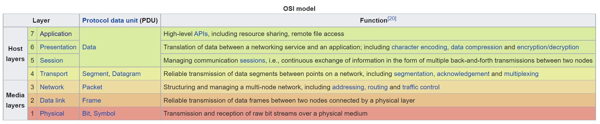

## Breaking the web and putting it back together
Today I wanted to break the web and put it back together again. It is very helpful to understand how the World Wide Web works as a web developer and to better understand it, we need to break it, or at least break it down.

## Internet and World Wide Web are 2 different things
First, we need to understand the difference between the Internet and the World Wide Web. The World Wide Web sits on top of the Internet, but is not the Internet itself.

The Internet is a network of computers and systems that connect everyone together. Before the Internet, people would call into "bulletin boards" over their physical land line phone connections using modems. Local area networks (LANs) would connect computers together in a room, or a building. The Internet became a way to keep everyone connected together via a massive wide area network (WANs) that extend outside of a building to other buildings and cities.

The World Wide Web was a proposal made in 1991 by Tim Berners-Lee and is an "application layer" protocol known as HTTP or Hyper Text Transfer Protocol. While it exists on and uses the Internet, it is a set of standards that browsers rely on to communicate with servers in order to access "resources" on those servers.

## TCP - Transport Layer
If you are a Computer Science major, you may have learned about the OSI network layer model. 



I don't want to go into great detail about this topic, but there are several layers to a network. For instance, the physical layer could use a network cable, fiber optic line, or a wireless signal. 

The "transport" layer sits a bit higher on the network stack and is in charge of deciding how to "package" things up to be sent to another computer. Today, TCP (Transmission Control Protocol) and UDP (User Datagram Protocol) are two of the most common transport protocols used on the internet.

One of the duties of TCP is to "slice" the data into chunks or packets for transport then reassemble them on the other end. This is commonly referred to as segmentation/desegmentation. To demonstrate this principle, let's use twitter as an example.

If you are on twitter, you know that the size of a message is limited to a certain number of characters. It was 140 characters until in 2017 when twitter increased the limit to 280 characters.

If you have a long message to post on twitter, you must divide your message into 280 character or smaller chunks. However, these message chunks may arrive out of order and be confusing to the reader. To handle this issue, you can still see people today put a series of numbers seperated by a slash (2/6) to denote how many total chunks there are and which chunk they are currently viewing.

Below is an example of a block of text from Wikipedia converted into 6 smaller blocks of text for twitter.

```text
> 6/6 sorted, so they would be ready for reuse. Errors in sorting would produce later misprints.

> 5/6 lower case 'd' looks like a 'q'. This is reputed to be the origin of the expression "mind your p's and q's". It might just as easily have been "mind your b's and d's".[3]A forgotten but important part of the process took place after the printing: the expensive sorts had to be

> 4/6 hand, and set into a composing stick held in the left hand from left to right, and as viewed by the setter upside down. As seen in the photo of the composing stick, a lower case 'q' looks like a 'd', a lower case 'b' looks like a 'p', a lower case 'p' looks like a 'b' and a

> 3/6 press and inked, and then printed (an impression made) on paper.[3] Metal type read backwards, from right to left, and a key skill of the compositor was their ability to read this backwards text.During typesetting, individual sorts are picked from a type case with the right

> 2/6 compositor assembled these sorts into words, then lines, then pages of text, which were then bound tightly together by a frame, making up a form or page. If done correctly, all letters were of the same height, and a flat surface of type was created. The form was placed in a

> 1/6 During much of the letterpress era, movable type was composed by hand for each page by workers called compositors. A tray with many dividers, called a case, contained cast metal sorts, each with a single letter or symbol, but backwards (so they would print correctly). The
```

TCP performs similar functions on your data and breaks it into packets for transport. Additionally, it marks those packets with a 'sender' and 'recipient' address and a timestamp, much like you would address a letter with a 'to' and 'from' address. 

Addresses in the internet world are IP addresses and represent a machine or a virtual machine. IPv4 addresses are 4 segments of numbers ranging from 0-255 and look like this:  192.168.121.4 
IPv6 is much longer an uses a combintation of letters and numbers, specifically, IPv6 is represented as eight groups, separated by colons, of four hexadecimal digits (in case you were wondering).

## TCP sample app
There is a lot of detail behind TCP that we won't get into, but we will use TCP in our app to build the next layer we care about, the application layer. There are many protocols that exist on the application layer, such as SMTP (Simple Mail Transfer Protocol), FTP (File Transfer Protocol), NTP (Network Time Protocol) and HTTP (Hypertext Transfer Protocol) to a name just a few. We eventually want to dig into HTTP more, but first let's build a simple TCP Client/Server application to understand how TCP works and how it sits under our application layer.


## HTTP - Application Layer